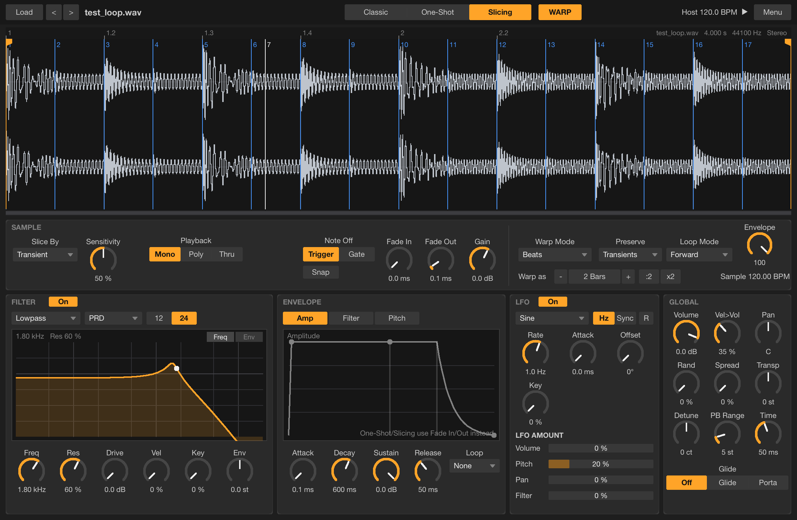

# Audio plug-ins: Smempler, Multidyn, Locus, Stretchr, Smacheratr, Perrera

VST3 plug-ins for REAPER, Ableton Live and any other VST3 host on **macOS, Windows and Linux**, built on the
Steinberg VST3 SDK and VSTGUI. MIT licensed.

| Plug-in | What it is | Modelled on |
|---|---|---|
| [**Smempler**](plugins/smempler/README.md) | Sampler instrument: Classic / One-Shot / Slicing, tempo-synced warping, multi-circuit filter, breakpoint envelopes, LFO | Ableton Live's Simpler |
| [**Multidyn**](plugins/multidyn/README.md) | Multiband upward/downward compressor-expander with side-chain | Ableton Live's Multiband Dynamics |
| [**Locus**](plugins/locus/README.md) | Low-end contrast: brings the dominant bass events into focus or thickens the low end | iZotope Ozone's Low End Focus |
| [**Stretchr**](plugins/stretchr/README.md) | Pitch/time-stretch clip editor: 7 algorithms, stretch markers, pitch envelope, formants; bounce in place or drag the render to a track | REAPER's stretch modes and stretch markers |
| [**Smacheratr**](plugins/smacheratr/README.md) | Waveshaping saturator: 8 curves from analog clip to wavefolding, Bass Shaper threshold, colour filters, soft/hard post clip, 4x oversampling | Ableton Live's Saturator |
| [**Perrera**](plugins/perrera/README.md) | Parallel high-pass + low-pass that track MIDI (root, transpose, bend, key), with a split envelope | a morphing EQ, Live-styled |



The plug-ins were called Simplr and Lowfocus until 0.5.0; projects keep loading (the plug-in IDs are unchanged).

## Install

**macOS** (universal: Apple Silicon + Intel) **and Linux** (x86_64):

```sh
curl -fsSL https://raw.githubusercontent.com/bfielstr/audio-plugins/main/scripts/install.sh | sh
```

**Windows** (x64), in PowerShell. Run it as Administrator to install into
`C:\Program Files\Common Files\VST3`; otherwise it installs for your user only:

```powershell
irm https://raw.githubusercontent.com/bfielstr/audio-plugins/main/scripts/install.ps1 | iex
```

The installers download the latest [release](https://github.com/bfielstr/audio-plugins/releases), verify
its SHA-256 checksum and install the `.vst3` bundles into a **`bfielstr`** folder inside the standard
VST3 folder (e.g. `~/Library/Audio/Plug-Ins/VST3/bfielstr/`). Running an installer again replaces the
installed versions; copies that older installers put directly in the VST3 folder, and the bundles of
the old names Simplr and Lowfocus, are removed (only ours; the vendor in the bundle is checked). Options (environment variables):
`SIMPLR_PLUGINS="Multidyn Locus"` installs only some plug-ins, `SIMPLR_VERSION=v0.5.0` picks a
release, `SIMPLR_DEST=...` chooses the VST3 folder.

Then in REAPER: *Options → Preferences → Plug-ins → VST → Re-scan*; in Live: *Settings → Plug-ins →
Rescan* (with *Use VST3 Plug-in System Folders* on).

## Presets

Every plug-in has a **Presets** menu in its header: the presets in your preset folder, *Save
Preset...*, *Load Preset File...* and *Reset to Defaults*. Presets are standard `.vstpreset` files,
so hosts can load them as well. They live in

| | |
|---|---|
| Windows | `Documents\VST3 Presets\bfielstr\<plug-in>` |
| macOS | `~/Library/Audio/Presets/bfielstr/<plug-in>` |
| Linux | `~/.vst3/presets/bfielstr/<plug-in>` |

## Build from source

```sh
git clone https://github.com/bfielstr/audio-plugins.git && cd audio-plugins
cmake -B build -DCMAKE_BUILD_TYPE=Release   # first run downloads the VST3 SDK into external/
cmake --build build --config Release        # also runs Steinberg's VST3 validator on each plug-in
ctest --test-dir build -C Release           # DSP tests (+ plug-in host tests on macOS)
```

- **macOS**: Command Line Tools are enough (no Xcode needed). `scripts/build.sh` builds, tests and installs.
- **Linux**: needs `libx11-dev libx11-xcb-dev libxcb-util-dev libxcb-cursor-dev libxcb-keysyms1-dev
  libxcb-xkb-dev libxkbcommon-dev libxkbcommon-x11-dev libfontconfig1-dev libcairo2-dev
  libfreetype6-dev libpango1.0-dev libgtkmm-3.0-dev` (Debian/Ubuntu names; gtkmm is only for the SDK's test hosts).
- **Windows**: Visual Studio 2022 with the C++ workload; use `cmake -B build -A x64`.

Every push is built and tested on all three platforms by GitHub Actions; pushing a `v*` tag
publishes a release and then runs the installers against it.

## Layout

```
plugins/smempler     sampler                 src/core (DSP) · src/plugin (VST3) · src/ui · tests
plugins/multidyn   multiband dynamics      same structure
plugins/locus   low-end focus           same structure
plugins/stretchr   pitch/time editor       same structure (reuses Smempler's warp engines)
plugins/smacheratr saturator              same structure
plugins/perrera    parallel filters        same structure
shared/pluginkit   code all plug-ins share: parameter tables, VST3 controller/editor bases,
                   VSTGUI widgets, the macOS host-test harness
cmake/PluginKit.cmake   SDK fetch + pk_add_plugin() / pk_add_host_test()
scripts            build.sh, install.sh, install.ps1
```

Each plug-in keeps its DSP free of any framework so it is tested headlessly (`*_tests`); the
`*_hosttest` programs load the built bundles through the VST3 hosting API, play audio/MIDI, check
state, drive the real editor with synthetic mouse events and save screenshots.

## License

MIT (see [LICENSE](LICENSE)). Third-party components: see [THIRD_PARTY_NOTICES.md](THIRD_PARTY_NOTICES.md).
