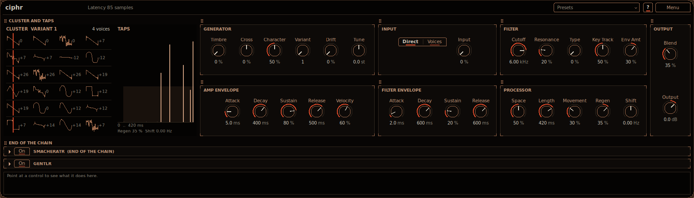

# Audio plug-ins: smemplr, multidyn, locus, stretchr, smacheratr, para, widr, wubr, levlr, deepr, smoothr, gentlr, dropr, orbitr, ciphr, moistr, smeezr

VST3 plug-ins for REAPER, Ableton Live and any other VST3 host on **macOS, Windows and Linux**. Free
to use, not for sale (see [LICENSE](LICENSE)). The current version is **0.25.0**.

| Plug-in | What it does for you |
|---|---|
| [**smemplr**](plugins/smemplr/README.md) | Plays a sample from the keyboard. Loop it, slice it into hits, or warp it to the song tempo. A multi-mode filter, envelopes you can draw, an LFO, four modulation LFOs you drag onto any control, and an effects rack with up to 8 of the suite's effects in any order. |
| [**multidyn**](plugins/multidyn/README.md) | Squashes or opens up 1 to 4 frequency bands at once: quiet detail comes up and loud parts are held down, band by band. The **OTT** style gives the loud, dense, over-the-top sound; **Character** is smoother. Side-chain input and a Sub band. |
| [**locus**](plugins/locus/README.md) | Cleans up or thickens the low end. Positive Contrast brings the main bass notes forward and pushes the mud between them down; negative Contrast evens the low end out for weight. |
| [**stretchr**](plugins/stretchr/README.md) | Changes the pitch and timing of a clip recorded on a track: 8 algorithms, stretch markers, a drawn pitch envelope and formant control. Bounce the result in place or drag it to a track. |
| [**smacheratr**](plugins/smacheratr/README.md) | Adds warmth, grit or hard clipping. A pre-limiter stops transients from clipping harder than the rest, colour filters choose which frequencies saturate, and gentlr keeps a pushed sound from turning muddy or harsh. |
| [**para**](plugins/para/README.md) | A high-pass and a low-pass side by side. Pull them apart to carve a notch, then sweep it, fire it from MIDI notes, or use the **Vocal** movement, where the filter you move leads and fades the other out. Good for bass movement and filter sweeps. |
| [**widr**](plugins/widr/README.md) | Makes a part very wide without falling apart in mono. Widrs in the same project share out the stereo field by role, so they do not all widen the same place. |
| [**wubr**](plugins/wubr/README.md) | Two EQ bands whose level and frequency follow shapes you draw: wubs, pumps and sweeps, synced to the song or free, or fired once by MIDI or by hits in the audio. |
| [**levlr**](plugins/levlr/README.md) | Splits the sound into up to 4 bands and gives each a level and a saturator (Analog, Tape, Tube, Hard Clip, Fold). Lift the lows, dip the low mids, dirty up only the highs. |
| [**deepr**](plugins/deepr/README.md) | Makes a bass sound deeper without making it louder: dips the low mids only while the sub plays, and folds the sub to mono. No latency of its own. |
| [**smoothr**](plugins/smoothr/README.md) | A loudness limiter for the master or a bus that keeps the low end clean: the lows get a slow, smooth gain and the highs catch the fast peaks. True-peak ceiling and a scrolling gain-reduction history. |
| [**gentlr**](plugins/gentlr/README.md) | Keeps a mix clear by turning down mud and harshness only while they build up. Two bands plus a Sub and a High band, each cutting its region only while it is loud. |
| [**dropr**](plugins/dropr/README.md) | Slams a sound flat in 6 bands and drives it into a saturator. Negative ratios turn loud hits down below quieter parts, so a snare's body comes up and its snap is tamed. |
| [**orbitr**](plugins/orbitr/README.md) | Turns a sound into a swarm: 1 to 16 copies fly around you, each one bending in pitch as it moves towards or away from you. |
| [**ciphr**](plugins/ciphr/README.md) | An 8-voice synthesizer: clusters of wavetable oscillators you sweep with one knob, FM and ring modulation between them, and echoes that turn into reverb, with a frequency shifter in the feedback for endlessly climbing repeats. Metallic, screeching and vocal waves for alien textures, and Disperse, a dial that brings the sound back band by band. Can also play a track through its side-chain input. |
| [**moistr**](plugins/moistr/README.md) | Turns a dry bass (a detuned saw or a Reese, typically) into a wet, moving neuro texture: two broad bell EQs sweep the low end against each other, a resonant high shelf goes round a slow orbit, and a level-matched saturator makes it bite. After that it can split the sound into 3 or 4 moving bands: the low band held steady, the bands above it rising and falling on a seeded pattern, glued back with a compressor and a little grit, with an optional frequency shifter that never touches the sub. |
| [**smeezr**](plugins/smeezr/README.md) | A one-knob compressor. Turning up Squeeze first pulls every octave towards the balance of pink noise (dull sounds get brighter, harsh ones darker, the loudness stays), then past the middle adds an OTT-style boost on top: quiet details up, peaks down, most squashed at 100 %. At 0 it does nothing. |

## Gallery

| | |
|---|---|
| [](plugins/smemplr/README.md)<br>smemplr | [](plugins/multidyn/README.md)<br>multidyn |
| [](plugins/locus/README.md)<br>locus | [](plugins/stretchr/README.md)<br>stretchr |
| [](plugins/smacheratr/README.md)<br>smacheratr | [](plugins/para/README.md)<br>para |
| [](plugins/widr/README.md)<br>widr | [](plugins/wubr/README.md)<br>wubr |
| [](plugins/levlr/README.md)<br>levlr | [](plugins/deepr/README.md)<br>deepr |
| [](plugins/smoothr/README.md)<br>smoothr | [](plugins/gentlr/README.md)<br>gentlr |
| [](plugins/dropr/README.md)<br>dropr | [](plugins/orbitr/README.md)<br>orbitr |
| [](plugins/ciphr/README.md)<br>ciphr | [](plugins/moistr/README.md)<br>moistr |
| [](plugins/smeezr/README.md)<br>smeezr | |

## What every plug-in has

- **smacheratr at the end.** Every plug-in ends its chain with smacheratr, with all its controls. A
  new instance runs through it with gentlr on and gentlr's **Slope** at **Signature**, and smacheratr's
  own defaults as they are (Drive 0 dB, Pre-Limit on at -6 dB, No Clip, Dry/Wet 100 %); switch
  **Saturator** off for the plug-in alone. Projects and presets saved with 0.24 or earlier load as they
  were saved (where they did not set them: smacheratr at the end as it was then, off in most plug-ins,
  gentlr off, **12 / 12**). Factory presets start from **Init**, so they run through it too, except the
  few that switch it off (gentlr's and ciphr's **Dry Cluster**). That
  includes its **gentlr**: two bands, a **Sub** band (from 20 Hz up
  to a point of 20 to 100 Hz) and a **High** band (from a point of 2 to 16 kHz up). The Sub and High
  bands are always there and start at Range 0 dB, so they cut nothing until you pull them down.
  gentlr's **Slope**, **No Overlap**, band glue and **Advanced** mode (a Threshold per band and a Drive
  for the region it cuts) are there too.
- **Info box.** A strip along the bottom of every window. Point at a control or a display and it says
  what it is and what it does. The **?** in the header switches the floating tooltips on and off; the
  info box is always there.
- **Free resizing.** Drag the window corner to any shape. The interface keeps its proportions, zoomed
  to fit and centred, never stretched. **Menu > Interface Size** sets the usual sizes.
- **Layouts.** **Menu > Layout** picks how the window is laid out: **Wide** (what a new instance
  opens in), a long, short strip for a DAW's device area, with the sections side by side as titled
  blocks in rows by purpose, or **Classic** (the fixed layout the plug-ins had before; see
  [Layouts](#layouts) below). In Wide, or a layout of your own, drag a block by its title strip to move
  it and drag its right edge to make it wider, then save the result under a name.
- **Reset and fine control.** A right click (or a double-click) on a control or a display handle puts
  it back to its default. Hold Shift while dragging for fine steps. The mouse wheel on a filter handle,
  while you hold it or with Shift over it, sets its resonance.
- **Copy Settings / Paste Settings** in every plug-in's **Menu** (and **Copy** / **Paste** on each
  effect's page in smemplr's rack) put the settings on the clipboard as text. Paste them into the same
  plug-in on another track, or between a plug-in and the same effect in smemplr's rack, both ways.
- **Presets** in the header of every plug-in: **Init** (every control at its default) always at the
  top, a few factory presets, your own presets in categories with tags you can filter by, and **Save
  as Default** so a new instance starts the way you like it (see below).
- **Defaults** in every plug-in's **Menu** (all but smemplr): **Gentlr On by Default** and **Advanced
  On by Default** decide whether gentlr (on unless you uncheck it), and its Advanced mode, are on in a
  new instance (see
  [Defaults for new instances](#defaults-for-new-instances)).
- The copper and cinnabar look described in [docs/THEME.md](docs/THEME.md).

Older names: smemplr was called simplr and locus was called lowfocus until 0.5.0. gentlr was called
gently before 0.12. smacheratr's gentlr was called Clarity. Projects keep loading: the plug-in IDs are
unchanged.

## Install

### Download the installer for your system

- **macOS** (Apple Silicon and Intel, macOS 11 or newer):
  [Plugins-macOS.pkg](https://github.com/bfielstr/audio-plugins/releases/latest/download/Plugins-macOS.pkg)
- **Windows** (64-bit, Windows 10 or newer):
  [Plugins-Windows-x64-Setup.exe](https://github.com/bfielstr/audio-plugins/releases/latest/download/Plugins-Windows-x64-Setup.exe)

Double-click the file and follow the steps. You can untick any plug-ins you do not want. They are
installed for every user on the computer, into `/Library/Audio/Plug-Ins/VST3/bfielstr` on macOS and
`C:\Program Files\Common Files\VST3\bfielstr` on Windows. Running a newer installer replaces the
older versions. Copies under the older names above (such as `Gently.vst3`) are removed, and so are
copies the one-line scripts put in your own user folder, so nothing shows up twice. On Windows,
uninstall from *Settings → Apps → Installed apps → Audio plug-ins (bfielstr)*.

### If your computer will not open the installer

The installers are not signed yet, so your computer may warn you the first time you open one. These
steps tell it that you trust the file you downloaded from this page.

- **macOS** says the installer "cannot be opened" or "cannot verify the developer": in Finder,
  right-click (or Control-click) the file and choose *Open*, then click *Open* again. If there is no
  *Open* button, go to *System Settings → Privacy & Security*, scroll down and click *Open Anyway*
  next to the message about the installer. Then enter your password.
- **Windows** shows a blue "Windows protected your PC" box: click *More info*, then *Run anyway*.

### One-line install scripts

If you prefer the command line, these do the same for your user only and also work on Linux.

**macOS** (universal: Apple Silicon + Intel) **and Linux** (x86_64):

```sh
curl -fsSL https://raw.githubusercontent.com/bfielstr/audio-plugins/main/scripts/install.sh | sh
```

**Windows** (x64), in PowerShell. Run it as Administrator to install into
`C:\Program Files\Common Files\VST3`; otherwise it installs for your user only:

```powershell
irm https://raw.githubusercontent.com/bfielstr/audio-plugins/main/scripts/install.ps1 | iex
```

The scripts download the latest [release](https://github.com/bfielstr/audio-plugins/releases), check
its SHA-256 checksum and install the `.vst3` bundles into a **`bfielstr`** folder inside the standard
VST3 folder (e.g. `~/Library/Audio/Plug-Ins/VST3/bfielstr/`). Running a script again replaces the
installed versions. Copies that older installers put directly in the VST3 folder, and bundles under the
older names above, are removed. Only ours are touched: the vendor in the bundle is checked.

Options (environment variables): `SIMPLR_PLUGINS="Multidyn Locus"` installs only some plug-ins,
`SIMPLR_VERSION=v0.25.0` picks a release, `SIMPLR_DEST=...` chooses the VST3 folder.

### Install by hand

Download the zip for your system from the
[latest release](https://github.com/bfielstr/audio-plugins/releases/latest), unzip it and copy the
`.vst3` bundles you want into a `bfielstr` folder inside your VST3 folder: `/Library/Audio/Plug-Ins/VST3`
or `~/Library/Audio/Plug-Ins/VST3` on macOS, `C:\Program Files\Common Files\VST3` on Windows,
`~/.vst3` on Linux.

### After installing

In REAPER: *Options → Preferences → Plug-ins → VST → Re-scan*. In Live: *Settings → Plug-ins →
Rescan* (with *Use VST3 Plug-in System Folders* on).

## Presets

Every plug-in has a **Presets** menu in its header. From the top:

- **Init**: every control back to its default, as a new instance with no saved default. It is always
  there and cannot be overwritten or deleted.
- **Factory** presets that come with the plug-in, in sub-menus by category. They cannot be changed
  either: save a copy under your own name instead.
- **User**: your presets. A preset saved with a category goes into a sub-menu of that name.
- **Tags**: pick a tag to see only the presets that carry it (factory ones included); **All** shows
  everything again.
- **Save** (over the current preset, if it is one of yours), **Save As...** (a name, an optional
  category and tags, separated by commas), **Rename...**, **Edit Tags...** and **Delete...**.
- **Save as Default** stores the current settings as the plug-in's default: every new instance starts
  from them, and **Load Default** brings them back. **Reset Default** goes back to the factory
  defaults. A project you open still loads exactly as it was saved.
- **Save Preset File...** and **Load Preset File...** save or open a `.vstpreset` file anywhere.

Presets are standard `.vstpreset` files, so hosts can load them as well. Tags and the category are
stored in the file's metadata, and files from older versions load as before (they just have no tags).
They live in

| | |
|---|---|
| Windows | `Documents\VST3 Presets\bfielstr\<plug-in>` |
| macOS | `~/Library/Audio/Presets/bfielstr/<plug-in>` |
| Linux | `~/.vst3/presets/bfielstr/<plug-in>` |

with one sub-folder per category. The saved default is the hidden file `.default.vstpreset` in the
same folder: delete it (or use **Reset Default**) to go back to the factory defaults.

smemplr's effects rack uses the same presets: a slot holding para, multidyn, smacheratr, widr, wubr,
levlr, gentlr or smoothr has a **Presets** control with that plug-in's menu, reading and writing the
same folder, so presets (and the saved default) go both ways between a slot and the plug-in. See the
[smemplr README](plugins/smemplr/README.md#a-slots-presets).

## Defaults for new instances

Every plug-in except smemplr has a **Defaults** sub-menu in its **Menu**, after **Layout**, with two
items you can check:

- **Gentlr On by Default**: a new instance starts with gentlr on in smacheratr at the end, and
  smacheratr at the end on (gentlr is not heard while it is off), with its other controls as they would
  be (by default Drive 0 dB, Pre-Limit on at -6 dB, No Clip, Dry/Wet 100 %). This is how a new instance
  starts anyway, so it is checked until you uncheck it. Unchecked, a new instance starts with gentlr
  off and smacheratr at the end as it would be (on, unless your saved default has it off).
- **Advanced On by Default**: a new instance starts with gentlr's **Advanced** mode on (unchecked: off).

In smacheratr they set its own **Gentlr** (on in a new smacheratr) and **Advanced**. gentlr has only **Advanced On by
Default**, for its own **Advanced**, which is already on in a new gentlr: uncheck it to have new
instances start with Advanced off.

Until you pick one, it shows the plug-in's factory default (gentlr on, Advanced off) and changes
nothing. A pick is saved at once
in the hidden file `.defaults.txt` in the plug-in's preset folder (beside the saved default), so it
lasts after you close the host and applies to every new instance of that plug-in. It applies only when
you insert a new instance: the instance you pick it in keeps its settings, a project you open loads
exactly as it was saved, and a preset, **Init** or **Load Default** loads exactly its own settings.
With a saved default (**Save as Default**), a new instance starts from it and then gets these two on
top, since you set them yourself. Delete `.defaults.txt` to go back to how the plug-in started before.

## Layouts

Every plug-in has a **Layout** sub-menu in its **Menu**:

- **Wide**: the controls as titled blocks side by side, so the window is wide and short, like a device
  in Live's device view. A new instance opens in it, and so does a project saved before layouts.
  Blocks are in rows by purpose: for most plug-ins the display and the plug-in's own controls in the
  first row and smacheratr at the end of the chain in a row of its own under it, as wide as the window.
  smemplr has two rows of about the same width: the sound (waveform over the sample row, filter,
  envelopes, the list of mappings) and then the effects rack, the output, the global controls, the LFO
  and the modulation LFOs. smacheratr shows its Gentlr controls as a column beside the two displays.
- **Classic**: the fixed layout every plug-in had before layouts (it was called Default then). A
  project saved in it keeps it.
- Your **saved layouts**, by name.
- **Save Layout As...** stores the layout you have now under a name (saving under a name that exists
  replaces it). **Use as Default Layout** makes every new instance open in it instead of Wide (Classic
  too). **Delete Layout** removes a saved one.

In Wide or a saved layout, the blocks fill their rows: every row runs the full width of the window, with
the same 8 pixel gap between blocks, between rows and at the edges. The window is as wide as the widest
row needs, and the blocks of a narrower row are stretched to that width, each in proportion to its own
width. The blocks of a row are all as tall as its tallest one. A section's panel grows to fill its
block, with its controls centred in it, and smacheratr at the end of the chain is built as wide as its
block.

Each block has a title strip with a grip at its left. Drag the strip to move the block: a cinnabar line
shows where it will land, beside another block, above or below one (they then share a column), or in a
row of its own above or below the others. Drag a block's right edge to make it wider (the other blocks
of its row give it room; a block can ask for up to twice its own width). A layout you change this way
shows as **Custom (not saved)** until you save it.

The window takes the layout's shape at the size it shows. If the host keeps the window as it is, the
interface is zoomed to fit inside it, so every control is still there. The layout you pick is saved
with the project. Loading a preset does not change it.

Saved layouts and the default layout are kept in `.layouts.txt` in the plug-in's preset folder (see
the table above), one `name = layout` per line.

The factory presets are text files in `plugins/<plug-in>/presets/<category>/` in the source, built
into the plug-in. Each line sets one control by its name, as the plug-in shows its value (for example
`Band 1 Range = 6 dB`); controls a file does not name stay at their defaults. The format is described
in [shared/pluginkit/PresetStore.h](shared/pluginkit/PresetStore.h).

## Build from source

```sh
git clone https://github.com/bfielstr/audio-plugins.git && cd audio-plugins
cmake -B build -DCMAKE_BUILD_TYPE=Release   # first run downloads the VST3 SDK into external/
cmake --build build --config Release        # also runs Steinberg's VST3 validator on each plug-in
ctest --test-dir build -C Release           # DSP tests (+ plug-in host tests on macOS)
```

- **macOS**: Command Line Tools are enough (no Xcode needed). `scripts/build.sh` builds, tests and installs.
- **Linux**: needs `libx11-dev libx11-xcb-dev libxcb-util-dev libxcb-cursor-dev libxcb-keysyms1-dev
  libxcb-xkb-dev libxkbcommon-dev libxkbcommon-x11-dev libfontconfig1-dev libcairo2-dev
  libfreetype6-dev libpango1.0-dev libgtkmm-3.0-dev` (Debian/Ubuntu names; gtkmm is only for the SDK's test hosts).
- **Windows**: Visual Studio 2022 with the C++ workload; use `cmake -B build -A x64`.
- **Draw benchmark** (Linux): `-DPK_DRAW_BENCH=ON` adds `<plug-in>_drawbench` (also run by ctest): it plays
  a test signal through each plug-in and times its editor's repaints with and without the cached display
  layers, checks both give the same pixels, and counts the repaints still asked for once the audio stops.

## Developing

```sh
# once: Ninja, the draw benchmarks (Linux), and ccache when it is installed
cmake -B build -G Ninja -DCMAKE_BUILD_TYPE=Release -DPK_DRAW_BENCH=ON \
  -DCMAKE_C_COMPILER_LAUNCHER=ccache -DCMAKE_CXX_COMPILER_LAUNCHER=ccache
cmake --build build                                      # everything
cmake --build build --target orbitr_tests Orbitr         # one plug-in: its DSP tests and its bundle
ctest --test-dir build -R '^orbitr_' --output-on-failure # one plug-in's tests
ctest --test-dir build -j 4 --output-on-failure          # everything, before a pull request
```

- **Targets** per plug-in (`orbitr` here): `orbitr_tests` (DSP tests), `orbitr_state_tests` (saved
  state; ciphr, dropr, gentlr, moistr, smacheratr and smemplr), `Orbitr` (the bundle, checked by the
  VST3 validator as it builds), `orbitr_drawbench` (with `-DPK_DRAW_BENCH=ON`, Linux) and
  `orbitr_hosttest` (macOS). The tests are named `orbitr_core`, `orbitr_state`,
  `orbitr_drawbench`, `orbitr_drawbench_layouts` and `orbitr_hosttest`.
- **Tests in parallel.** `ctest -j` is safe: the tests that time the DSP against a CPU budget are
  marked `RUN_SERIAL` and labelled `cpu` (`pk_cpu_test` in `cmake/PluginKit.cmake`), so ctest runs
  them on their own. `ctest -L cpu` runs only those, `ctest -LE cpu` everything else.
- **Some plug-ins only.** `-DPK_ONLY_PLUGINS="orbitr;ciphr"` configures only those plug-ins (and the
  libraries of the plug-ins they use, without their tests or bundles); empty builds all of them. Pull
  requests on GitHub build this way (below).
- **ccache** across worktrees: set `CCACHE_BASEDIR` to the checkout's folder (for example
  `export CCACHE_BASEDIR="$PWD"`) so separate checkouts of the same sources share cache hits.

## Continuous integration and releases

Every push to main and every pull request is built and tested on macOS, Linux and Windows by GitHub
Actions (`.github/workflows/build.yml`). A pull request builds and tests only the plug-ins it changes,
with the plug-ins that use them (`scripts/ci-changed-plugins.py`); a change outside `plugins/<name>/`
(`shared/`, `cmake/`, the root `CMakeLists.txt`, `.github/`, `installer/`, `scripts/`, ...) builds all
of them. Pushes to main and releases always build everything. The screenshots in `docs/<plug-in>/` come
from the macOS host tests.

To release a version:

1. In a pull request, raise the version in the root `CMakeLists.txt` (`project(AudioPlugins VERSION
   x.y.z)`), in every `plugins/*/CMakeLists.txt` (`VERSION x.y.z.0`) and in the line "The current
   version is" at the top of this README.
2. Merge it. `.github/workflows/release-tag.yml` sees the higher version on main, checks that every
   plug-in has it, tags the merge commit `vX.Y.Z` and starts the release build on the tag: universal
   Mac binaries, the installers, the release with its zips and installers, then the installers tested
   against it. An existing tag is never moved, and running it again does nothing.

Pushing a `v*` tag by hand still works the same way.

## Layout

```
plugins/smemplr     sampler                  src/core (DSP) · src/plugin (VST3) · src/ui · tests · presets
plugins/multidyn    multiband dynamics       same structure
plugins/locus       low-end contrast         same structure
plugins/stretchr    pitch/time editor        same structure (reuses Smemplr's warp engines)
plugins/smacheratr  saturator                same structure
plugins/para        parallel filters         same structure
plugins/widr        stereo width             same structure
plugins/wubr        drawn band LFOs          same structure
plugins/levlr       four-band levels         same structure
plugins/smoothr     low-end-first limiter    same structure
plugins/deepr       bass depth by contrast   same structure
plugins/gentlr      gentle de-mud / de-harsh same structure
plugins/dropr       multiband compressor     same structure
plugins/orbitr      doppler swarm            same structure
plugins/ciphr       wavetable synthesizer    same structure
plugins/moistr      sweeps, moving bands     same structure
plugins/smeezr      one-knob pink / OTT      same structure
shared/pluginkit    code all plug-ins share: parameter tables, VST3 controller/editor bases,
                    the preset store, VSTGUI widgets, the instance registry, the macOS host-test harness
cmake/PluginKit.cmake   SDK fetch + pk_add_plugin() / pk_add_host_test()
cmake/EmbedPresets.cmake  builds a plug-in's presets/*.txt into it (its factory presets)
scripts             build.sh, install.sh, install.ps1
installer           the double-click installers: macos (.pkg), windows (Inno Setup), their CI tests
```

Each plug-in keeps its DSP free of any framework so it is tested headlessly (`*_tests`); the
`*_hosttest` programs load the built bundles through the VST3 hosting API, play audio/MIDI, check
state, drive the real editor with synthetic mouse events and save screenshots.

## Credits and licences

The plug-ins are free to use, including for commercial music, but may not be sold, bundled into paid
products or redistributed in modified form (see [LICENSE](LICENSE)). The copyright holder keeps all
rights. Versions 0.14.0 and earlier were released under the MIT licence and stay under it. They are built on the Steinberg VST 3 SDK
(MIT licence) and VSTGUI (BSD 3-clause licence). smemplr reads audio files with dr_wav, dr_flac and
dr_mp3 by David Reed (public domain / MIT-0). multidyn's OTT style uses the constants and laws of David
Braun's fit of OTT (`co.xfer_ott` in the Faust libraries' `compressors.lib`, MIT licence). The full
notices are in [THIRD_PARTY_NOTICES.md](THIRD_PARTY_NOTICES.md).

VST is a trademark of Steinberg Media Technologies GmbH, registered in Europe and other countries. OTT
is a product of Xfer Records; multidyn is not affiliated with or endorsed by Xfer Records.
