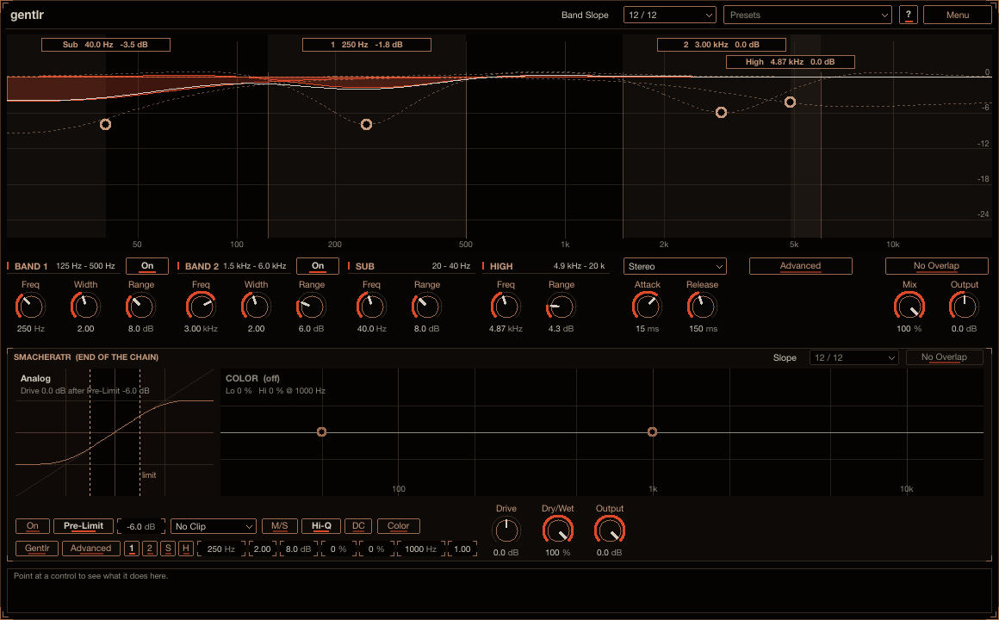
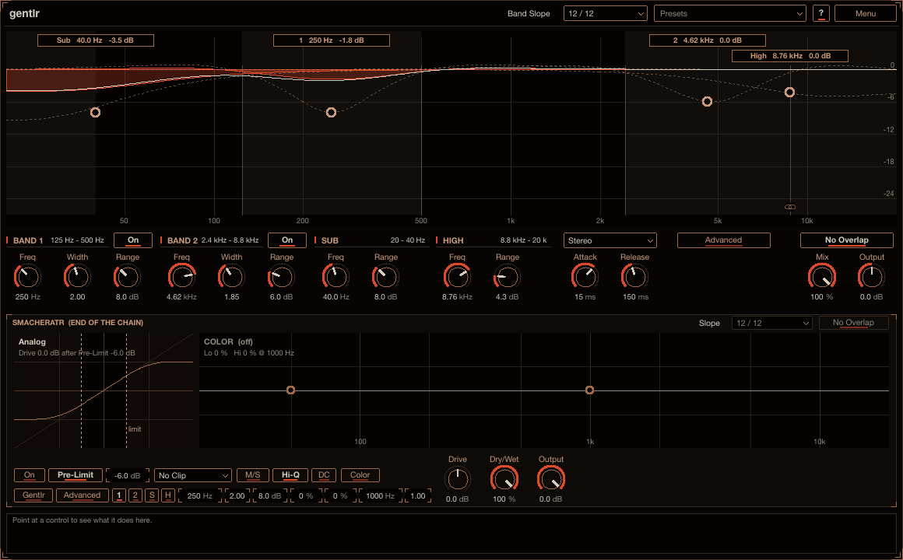
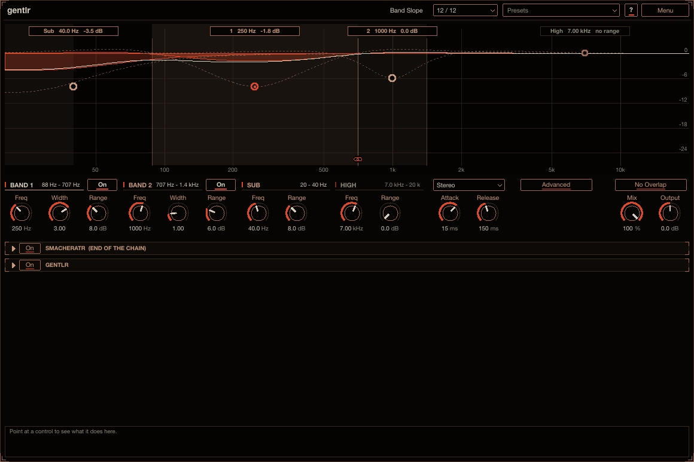
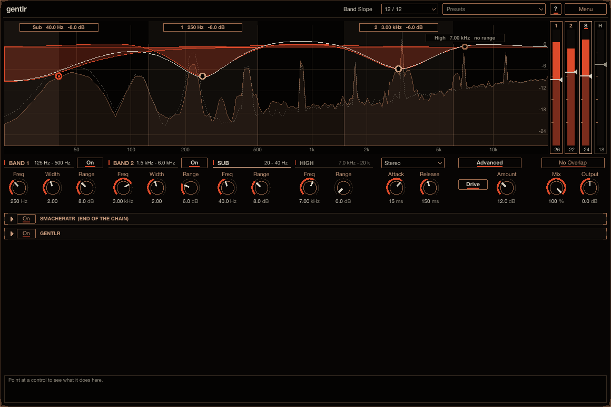

# gentlr

gentlr keeps a mix clear by turning down mud and harshness only while they build up. It watches four
regions of the spectrum (the low mids, the upper mids, the sub and the top) and turns each one down only
while it gets loud. At normal levels the sound keeps all its body and bite; when a chord, a bass note or
a pushed synth piles up in one region, that region is pulled back. Reach for it on a mix, a bus or a
synth that sounds fine quietly but goes boomy, muddy or harsh when it gets busy or loud. Nothing is cut
while a band stays under its threshold. Install instructions are in the
[top-level README](../../README.md).

gentlr was called gently before 0.12. It is the same gentlr that smacheratr has built in.

## How to use it

1. Put gentlr on a track or a bus. **Band 1** (on the mud, 250 Hz) and **Band 2** (on the harshness, 3
   kHz) are already working.
2. Play the loudest part. In the display, the lit cinnabar areas show what each band is cutting right
   now. Drag a band's handle sideways to move it and down for more **Range** (the most it may cut).
3. For the sub or the top, pull the **Sub** or **High** handle down from 0 dB. For control over where
   each band starts cutting, use **Advanced** and its Threshold sliders.

Point at any control for help in the info box at the bottom (**?** also switches on hover tooltips).

The chain: **Input** -> **Band 1** -> **Band 2** -> **Sub** -> **High** (each turned down on its own
when it is loud; with Advanced, the region they cut can be driven) -> **Mix** -> **Output** ->
**smacheratr**.

## The bands

Each band is a region of the spectrum (a high-pass below it and a low-pass above it, their slopes set by
**Band Slope**, scaled so the band peaks at 0 dB) with a compressor on it. When the band's level (its
peak level) goes over -18 dBFS, the band is turned down by 3 dB for every 5 dB over (2.5 : 1, hard
knee), at most by its **Range**, which it reaches (Range / 0.6) dB over the threshold. The band is taken
out of the signal and put back turned down, so a band that is not cutting leaves the signal exactly as it
was, bit for bit.

- **Band 1**: the low mids, the mud: 250 Hz, 2 octaves wide, Range 8 dB.
- **Band 2**: the upper mids, the harshness: 3 kHz, 2 octaves wide, Range 6 dB.
- Each has **On**, **Freq** (20 Hz to 20 kHz), **Width** (0.5 to 4 octaves between the band's edges)
  and **Range** (0 to 24 dB; at 0 dB the band does nothing). The band's readout shows the edges of its
  region now. A band whose edge reaches an end of the spectrum (20 Hz or 20 kHz) turns into a shelf
  there: it runs flat past that end instead of dipping back up.
- **Sub**: a shelf for the sub region, flat from the very bottom of the spectrum up to its **Freq** (20
  to 100 Hz, 40 Hz by default), where its cut starts to let go (within about 1 dB of the full cut there,
  about half of it at twice that, nearly none two octaves up). It has a **Range**, the same law, and no
  width.
- **High**: the same for the top of the spectrum (harshness, fizz, sibilance), flat from its **Freq** (2
  to 16 kHz, 7 kHz by default) to the very top, its cut letting go below it (about half of it an octave
  down, nearly none two octaves down). 7 kHz puts the whole cut on the fizz and sibilance, half of it
  around 3.5 kHz where harshness starts, and leaves the presence region (1 to 3 kHz) that carries a voice
  or a lead alone. It has a **Range**, the same law, and no width.
- The Sub and High bands have no **On** button. They are always there and start at Range 0 dB, so they
  cut nothing until you pull their handle down in the display (or turn their Range up). At Range 0 dB
  gentlr sounds exactly as it does without them, bit for bit.

**Band Slope** (in the header, left of the presets; one setting for Band 1 and Band 2, the Sub and High
bands keep their own shape):

- **12 / 12** (the default): 12 dB/oct below the band and 12 dB/oct above it. The band is symmetric, so
  at its centre the cut is exactly what the law asks for.
- **Signature**: 24 dB/oct below, 12 dB/oct above. A steeper floor under the band, so a band on the low
  mids leaves the bass under it alone.
- **Classic**: 12 dB/oct below, 6 dB/oct above, the only shape before Band Slope existed.

A band at an end of the spectrum is still a shelf there, keeping the slope of its other side, and the
display draws the shape selected.

**Attack** (0.5 to 100 ms, 15 ms) and **Release** (20 ms to 2 s, 150 ms) set how fast a band's cut
follows its level going up and lets go after it. The bands work one after the other (Band 1, Band 2,
Sub, High), each measuring its own band.

**Stereo**: **Stereo** (left and right share one detector per band, so the image stays put),
**Mid/Side** (the mid and the side are worked on apart, each with its own detectors), **Mid** or
**Side** (only that one; the other passes). A change of mode fades gentlr out and back in (5 ms each
way), so it does not click.

## No Overlap

**No Overlap** (off by default): the bands never cover the same frequencies. Dragging or widening a band
in the display pushes its neighbours' edges along: a neighbour gets narrower, and once it is as narrow
as a band can be (0.5 octaves) it moves as a whole. Where a neighbour cannot move further (the Sub band
at 20 Hz, the High band at 16 kHz) the dragged band stops at it. Within one drag the push is measured
from where the bands were when it began, so dragging back lets them go back. Switched on, bands that
already overlap are split at the middle of the overlap, each giving up half. Only working bands take
part. A band covers the octaves between its edges, the Sub band everything below its Freq, the High band
everything above its Freq. Automation (or a band starting to work) that makes bands overlap is kept
apart the same way in the engine, so they never overlap in the sound either; bands that do not overlap
are left exactly where they are.

## Glue

Two neighbouring bands can be held at a shared border (nothing is glued by default). Drag a band's edge
(or the Sub or High band's handle) onto its neighbour's edge in the display: within a few pixels it
snaps on, and when you let go the two are glued there. A small link icon sits on the border at the
bottom of the display: copper where two bands only touch, lit cinnabar while they are glued.

- While glued, dragging the shared border moves both edges together (one band gets wider as the other
  gets narrower; for the Sub and High bands their Freq is the border), and moving one band drags its
  neighbour's edge along (a neighbour wider than 4 octaves or narrower than 0.5 moves as a whole).
- Click the link icon to detach the two (they stay where they are and move on their own again), or click
  it on two bands that touch to glue them.
- The pairs that can glue: Band 1 and Band 2, Sub and either band, either band and High (Sub and High
  never meet). Each pair is a parameter of its own (**Glue 1 / 2**, **Glue Sub / 1**, **Glue Sub / 2**,
  **Glue 1 / High**, **Glue 2 / High**), saved with the project. A glue holds while its two bands work and
  are neighbours along the spectrum.
- The engine holds a glued border under automation too: the lower band leads (the band above follows
  with its low edge), except that the High band's Freq leads the band under it. Glue and No Overlap work
  together; where automation makes them disagree, No Overlap wins.

## Advanced

**Advanced** gives each band its own **Threshold** instead of the fixed -18 dB: a vertical slider per
band (Band 1, Band 2, Sub, High) at the right edge of the display, with the band's level rising beside
it, bright where it is over the threshold (there the band is being cut). The law over the threshold
stays the same. Drag a slider (Shift: fine); a double-click or right click puts it back to -18 dB.
Advanced is on in a new gentlr (the Thresholds at -18 dB sound the same as Advanced off, so the sliders
are there to move). With Advanced off, the Thresholds are kept but not used.

Advanced also has the region **Drive** (and its **Amount**, 0 to 36 dB, 12 dB by default): the bands as
they leave, after their cuts, go through smacheratr's Analog curve on their own, level-matched and added
back, so the region gentlr works on gets denser and gains harmonics without getting louder, while the
rest of the sound stays clean. It runs 4x oversampled, fades in and out when switched, and a quiet region
passes it unchanged.

## The display

The display shows each band's region shaded, the most it can cut outlined (dashed), the cut it is making
now lit (cinnabar) from the 0 dB line and moving with the audio, a handle at its centre (Sub, High: at
their Freq) as deep as its Range, and the whole response as the bright line (every band at its cut now,
with its phase: the curve is what the sound gets). Behind them, the output's spectrum (filled) and the
input's (dotted), tilted 4.5 dB/oct so a mix reads level: where the input stands above the output, gentlr
is cutting. The readouts at the top show each band's frequency and its cut now.

- Drag a handle sideways for the band's frequency (Sub: 20 to 100 Hz, High: 2 to 16 kHz), down for its
  Range. The Sub and High handles sit flat at 0 dB until you pull them down.
- Drag a band's edge, or hold Alt / Option and drag the band sideways, for its width (the band stays
  centred); the mouse wheel on a handle (while you hold it, or with Shift) too. The Sub and High bands
  have no width.
- With No Overlap on, a band you drag or widen pushes its neighbours along.
- Drag a band's edge onto a neighbour's to glue the two; click the link icon on a border to detach them,
  or to glue two bands that touch.
- Double-click or right-click a handle to reset the band (its frequency, width and Range).
- Click Band 1's or Band 2's readout at the top to switch the band on or off.

**No Overlap**, **Mix** (dry / wet: the input, delayed to line up, against gentlr's output) and
**Output** (±24 dB, before the smacheratr at the end) sit at the right of the controls.

**smacheratr** (bottom panel): the saturator every plug-in here can end with (off, Drive 0 dB), with all
its controls, its own gentlr included.

gentlr is also in smemplr's effects rack.

## Presets

The **Presets** menu in the header starts with **Init** (every control at its default) and has these
factory presets: *Mixing*: De-mud, Tame Harshness; *Vocals*: Vocal Clarity. Save your own with
**Save As...** (a category and tags are optional), filter the menu by tag, and use **Save as
Default** to make every new gentlr start from the current settings. The menu is described in the
[top-level README](../../README.md#presets).

## Latency

The region Drive's 4x oversampler delays the signal a little (37 samples at 48 kHz). Its delay is always
in the path, with the dry signal delayed to match, so the latency never changes with the settings. The
end saturator adds its own (about 1.7 ms), also always in the path. Both are reported to the host for
automatic compensation.

## Older projects

Projects saved before Band Slope existed load with **Classic** and sound exactly as they did. Projects
saved while the Sub and High bands had On buttons sound the same: a band that was off loads with its
Range at 0 dB, one that was on keeps its Range. Projects saved before glue load with nothing glued.
