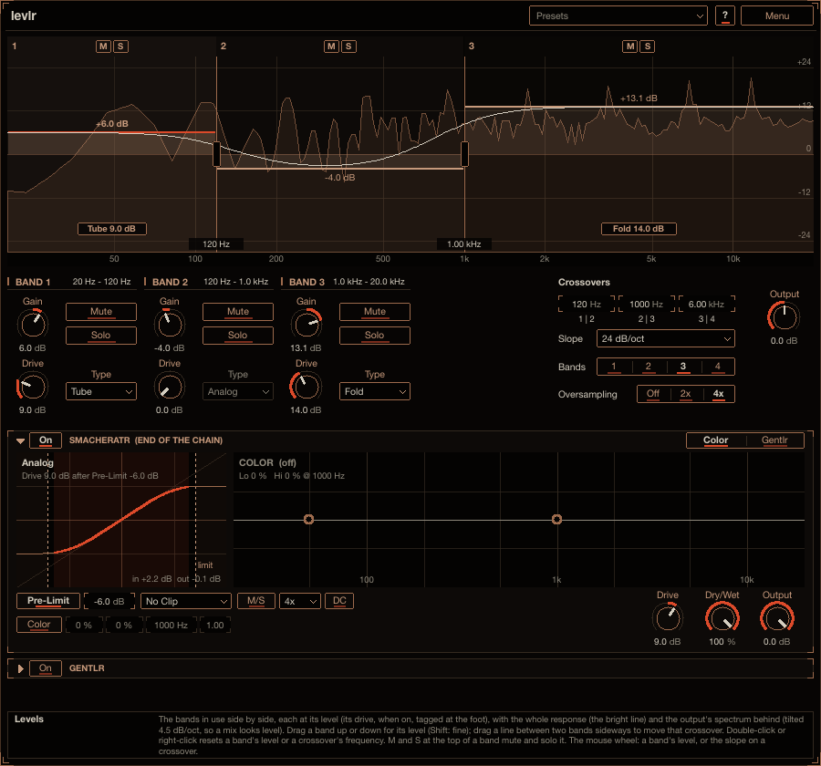

# Levlr

Levlr splits the sound into up to four bands that sit side by side, and gives each band its own level
and its own saturator. Lift the lows, dip the low mids, add grit only to the highs, or push one band
hard while the others stay clean, then drive the lot into the Smacheratr at the end. Reach for it as a
broad tone shaper on a bass, a drum bus or a full mix, or when you want to saturate one part of the
spectrum without touching the rest. Install instructions are in the
[top-level README](../../README.md).

## How to use it

1. Put Levlr on a track. It starts with 4 bands split at 120 Hz, 1 kHz and 6 kHz, all at 0 dB.
2. Drag a band up or down in the display for its level; drag the line between two bands sideways to move
   that crossover. Use **Bands** for fewer bands.
3. Turn up a band's **Drive** and pick its **Type** to saturate that band alone.

Point at any control for help in the info box at the bottom (**?** also switches on hover tooltips).

## Controls

Below the display each band in use has a column: its name and range, **Gain**, **Mute**, **Solo**, then
**Drive** and **Type** (dimmed while Drive is at 0 dB). **Crossovers** and **Slope** sit on the right,
with **Bands** next to Slope.

- **Bands**: 1 to 4 (4 by default). N bands use the first N-1 crossovers, and the last band in use
  reaches to 20 kHz (1: no split at all, the input as it is). The bands sit side by side from 20 Hz up:
  band 1 ends where band 2 starts, and so on. Each has a **Gain** (-24 to +24 dB), **Mute** and **Solo**
  (a soloed band is heard even when muted; with several soloed, all of them are). The bands past the
  count are left out and hidden. Changing the count crossfades over 20 ms.
- **Drive** and **Type**, per band: a saturator after the band's level. Drive is 0 to 36 dB; at 0 dB it
  is off and the band stays clean. The types:
  - **Analog**: Smacheratr's curve, clean up to half scale, then a soft knee.
  - **Tape**: soft all the way, odd harmonics.
  - **Tube**: leans to one side, so the top squashes first and it adds even harmonics, the second above
    all (its DC is filtered out).
  - **Hard Clip**: a flat top, the most edge.
  - **Fold**: folds back over past the top, hollow and metallic as it is pushed.

  An auto gain brings a sine at -12 dBFS back to the level it went in at, at every Drive and type, so
  more Drive adds colour rather than level, and a band turned up drives its curve harder. The curves run
  4x oversampled. Turning a drive on or off crossfades (15 ms), a new type crossfades between the two
  curves, and Drive glides (10 ms).
- **Crossovers**: three, at 120 Hz, 1 kHz and 6 kHz by default. Each stays at least 1/6 octave from its
  neighbours; one moved past them pushes the ones above it up. Moving one glides it there (no clicks).
- **Slope**: **12 dB/oct** to **96 dB/oct** in 12 dB steps, **24 dB/oct** by default. Every slope adds
  back to a flat level with all bands at 0 dB. Each turns the phase its own way: 12 gently (and parts the
  bands softly, so a band's lift spills a little into its neighbours), 96 the most (and the cleanest
  split). Changing it fades out and back in over a few milliseconds.
- **Output**.
- **Smacheratr** (bottom panel): the saturator every plug-in here can end with, with all its controls
  and displays (off by default, Pre-Limit on).

## The display

The Levels display shows the bands in use as numbered columns, each filled to its level (a driven band
has a tag with its type and Drive at its foot), the whole response as the bright line (the bands'
filters added up as the engine adds them, so the steps between levels look as they sound), and the
output's spectrum behind (tilted 4.5 dB/oct around 1 kHz, so a mix reads level).

- Drag a band up or down for its level (Shift: fine); drag the line between two bands sideways to move
  that crossover.
- Double-click or right-click a band to reset its level, a crossover to reset its frequency.
- **M** and **S** at the top of a band mute and solo it.
- The mouse wheel on a band sets its level; on a crossover, the slope.

## How it works

The crossovers are minimum-phase Linkwitz-Riley splits, so the phase turns around each one; that turn
is part of the sound (there is no linear-phase mode). The input splits at crossover 1 into band 1 and
the rest, the rest at crossover 2, and so on. Bands 1 and 2 then go through the all-passes of the
crossovers above them, so all four at 0 dB sum to one all-pass of the input: flat in level, shifted in
phase (at 24 dB/oct about 4 ms of delay at 120 Hz). With fewer bands the whole tree still runs and the
bands are taps on it, so a new count crossfades between two sets of taps that are both there. Each
driven band goes through its curve at 4x; the clean bands are delayed by the same amount, so the bands
stay in time.

## Latency

The drives' oversampling delays every band, driven or not, so the latency is the same whatever the
drives, their types and Bands are: 37 samples at 48 kHz (59 at 44.1 kHz, 14 at 96 kHz), plus the end
Smacheratr's. It is reported to the host. With every drive off the output is the undriven output bit
for bit, only that much later.

## Older projects

Projects from 0.6.0 and earlier (no Bands, no drives) load with four bands and every drive off: they
sound as they did, later by the drives' latency (which the host compensates).
