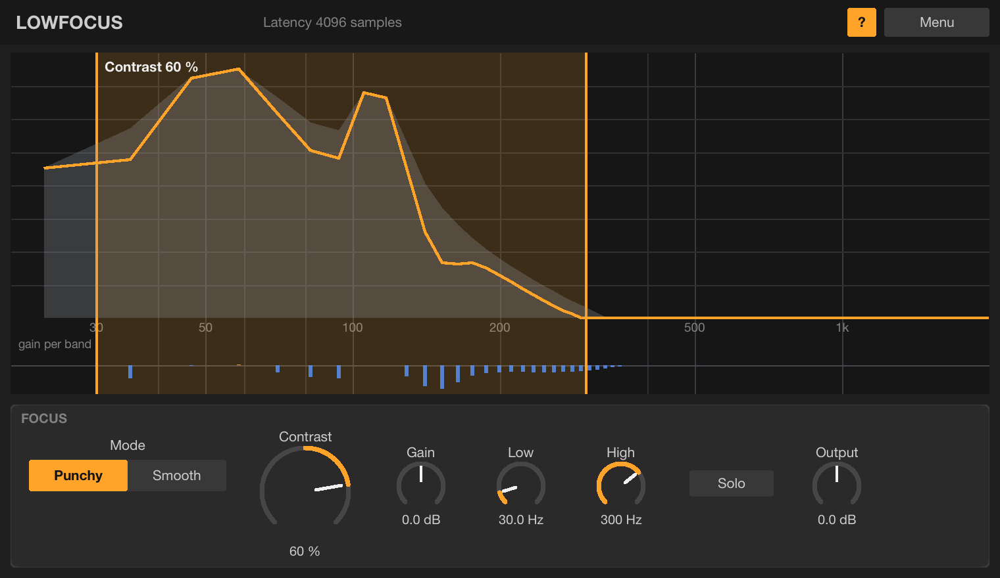

# Lowfocus

A low-end contrast processor in the spirit of iZotope Ozone's **Low End Focus**. Install
instructions are in the [top-level README](../../README.md).

## What it does

Lowfocus splits the low end into dozens of narrow bands (~12 Hz each) and compares every band's
level with its *neighbourhood*, the level of nearby bands over the recent past, instead of
against an absolute threshold like a compressor does.

- **Positive Contrast**: bands weaker than their surroundings are pushed down, including the mud
  between the harmonics of a bass note, so the dominant events come into focus (clarity, punch).
- **Negative Contrast**: everything moves closer in level (weight, density, sustain).
- The loudness of the range is kept steady, so Contrast changes focus, not level. **Gain** sets
  the level of the range.
- **Punchy** mode uses fast time constants (transients, impact); **Smooth** uses slow ones
  (sustain, weight).
- **Low / High** set the range (default 30–300 Hz). Everything outside it passes through
  untouched (bit-exact apart from the latency).
- **Solo** plays only the range.

The display shows the input spectrum (grey), the output (orange) and the gain applied per band.
Drag the range edges to move them, drag inside the range sideways to move it or up/down to set
Contrast, and double-click to reset Contrast.

Latency: about 85 ms (4096 samples at 48 kHz), reported to the host for automatic compensation.
