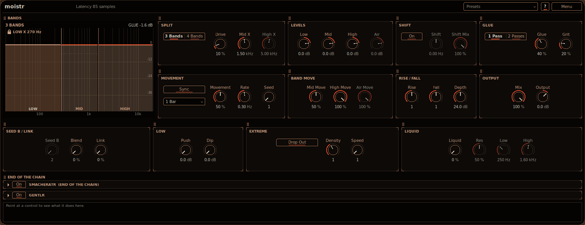

# moistr

moistr turns a dry bass, typically a detuned saw or a Reese, into the wet, moving texture of neuro bass.
Its core is the **SWEEP** stage, on by default: eight bell EQs sweep slowly up and down through the low
and low-mid range, some boosting and some cutting, each at its own rate and starting point, so they keep
rolling against each other like waves and the sound never quite repeats; then a saturator, level matched,
makes it all crunch, with **Sub Boost** adding the clean lows back under the crunch so the sub stays
present, and **Tone** rounding off the top. The defaults (**Init**, and the sound of every project from
before 0.30) are the **Ocean** recipe:

| Bell | Rate | Low to High | Gain | Width | Phase |
| --- | --- | --- | --- | --- | --- |
| A | 0.70 Hz | 20 to 120 Hz | +23.4 dB | 0.5 | 0 |
| B | 0.77 Hz | 30 to 300 Hz | -23.4 dB | 0.5 | 63 |
| C | 0.53 Hz | 80 to 600 Hz | +11.7 dB | 0.6 | 132 |
| D | 0.91 Hz | 150 to 1200 Hz | -11.7 dB | 0.6 | 40 |
| E | 0.41 Hz | 250 to 2000 Hz | +7.8 dB | 0.7 | 223 |
| F | 1.13 Hz | 400 to 3000 Hz | -10.4 dB | 0.7 | 292 |
| G | 0.63 Hz | 60 to 450 Hz | -7.8 dB | 0.5 | 252 |
| H | 0.84 Hz | 200 to 1600 Hz | +9.1 dB | 0.6 | 166 |

then 14 dB of drive on the **Soft** curve, **Sub Boost** at 70 Hz and 70 %, and **Tone** at 7 kHz. The
**High Shelf** (a resonant shelf on a slow orbit) is there too, off by default. Every channel goes through
the same filters with the same movement, so moistr never changes the stereo image.

After the sweep, moistr can also split the sound into **moving bands** (see [Moving bands](#moving-bands)):
the low end locked, the bands above it rising and falling on a seeded pattern, glued back together with a
compressor and soft clipping, with a frequency shifter, **Link** and a vowel-like **Liquid** resonance on
top. In a new instance they are all neutral (**Movement**, **Glue** and **Grit** at 0), so the sound is the
sweep alone; turn them up to layer the movement on. A **gesture** (see [Gestures](#gestures)) moves many
controls together in time with the song on the bands above the low end: band fades and swells, stutters, a
wobble, a closing filter, a dirty crossfade, all on one timeline. The **LAB** (see [LAB](#lab)) puts
effect chains on the bands above the low end: each band hits its own distortion and OTT, with one more OTT
on their sum. The **Neuro** preset uses all of it: dense, dirty and moving, with the sub clean.

**Input** sets the level going in, **Loop Lock** holds all of the movement on one moment of it and plays
that moment again in time with the song, **PARA** splits the sound into a low-pass and a high-pass path
that move against each other, and **Sub Guard** (on in a new instance) keeps the sub steady while
everything above it moves (see [Input, Loop Lock, PARA and Sub Guard](#input-loop-lock-para-and-sub-guard)).
The window opens on a **Basic** page of the main controls; **Advanced** shows every one (see
[The Basic page](#the-basic-page)). Install instructions are in the [top-level README](../../README.md).



## How to use it

1. Put moistr on a dry bass track, for example a detuned saw. The defaults already sound: eight bells roll
   through the low end like waves, the saturator crunches it and **Sub Boost** keeps the sub underneath.
2. Set how hard it bites with **Drive** in **SWEEP** (12 to 24 dB sounds best on most basses) and pick the
   **Curve** (**Hard** crunches more, **Soft** is gentler). The level follows the input, so more **Drive**
   is more grit, not more volume. **Tone** darkens the top.
3. Set the low end in **SUB**: **Sub Boost** adds the clean lows back after the saturator (**Freq**, how
   high they reach; **Level**, how much). **Clean Sub** instead sends the lows around the saturator, so
   only the rest crunches (**Split**, **Level**, and **Drive** to let the lows crunch a little too).
4. Shape the sweeps in **BELLS**: click a letter (**A** to **H**) to show that bell's controls: **Rate** (or
   **Sync** and its rate for the song tempo), where it goes (**Low**, **High**), how far it boosts or cuts
   (**Gain**), how broad it is (**Width**, 0.5 is broad) and where it starts (**Phase**). The row of letters
   under the picker switches each bell on or off.
5. For a talking top, switch on the **High Shelf** and set its orbit: where its corner goes (**Low**,
   **High**, up to 5 kHz), how far it cuts and boosts (**Min**, **Max**), how resonant it is (**Q**), how
   loose the orbit is (**Wander**: 0 a circle, higher a smooth random path) and how much less it boosts at
   high corners (**Tilt**, so it never gets nasal).
6. For more, layer the moving bands on: turn up **Movement** (and **Glue** and **Grit**), or start from the
   *Sweep/Sweep + Bands* preset. The other steps are under [Moving bands](#moving-bands).

Point at any control for help in the info box at the bottom (**?** also switches on hover tooltips).

## The technique

A common way of making this kind of bass by hand: a parametric EQ with a big, broad boost swept slowly
through the low end, a second with a broad cut swept a little faster over a wider range, a high shelf
moved around by hand (lower gain the higher it goes, so it does not get nasal), then a saturator. The two
sweeps at nearly the same rate keep moving against each other, so the sound never quite repeats. moistr
does all of that in one plug-in, with up to eight sweeps at once, and the sweeps follow the song position,
so a render is the same every time.

The older technique, splitting the bass into bands and letting the bands above the low end come and go
on their own timing, is moistr's second stage (the moving bands).

## Signal flow

```
input -> Input -> SWEEP: bells A .. H -> High Shelf -> saturator (level matched; Clean Sub: the lows around it)
               [+ Sub Boost: the saturator's input, low-passed] -> Tone
      -> [PARA: low-pass path + high-pass path, moving] -> Drive -> pass 1 -> [pass 2] -> Mix (dry / wet)
      -> Output -> smacheratr (the end saturator) -> [Sub Guard: the lows below Freq replaced by the steady ones]
motion clock: the song position, or (Loop Lock) the region of the window (Start .. End) once a Length: every
          clock below reads it (the bells, the shelf, the bands, Liquid, the gesture, Wobble, PARA)
pass:    split: Low | Mid | High [| Air] (crossovers) -> Low held, the others rising and falling
         -> [LAB, pass 1: Mid, High, Air each through its chain -> their sum through POST; Low delayed]
         -> [Liquid: the bands above Low only] -> [Shift: the bands above Low only] -> Low + the others
         -> Glue -> Grit
movement: Seed's pattern [blended with Seed B's] -> each band's rises and falls (Density, Rise / Fall,
          Speed, Depth [-> Drop Out]) [pulled together by Link]; the Low band's own pushes and dips (Push,
          Dip); Liquid's gliding resonance (Liquid Low .. Liquid High, raised by Link as the bands open)
gesture:  one timeline in time with the song, a lane per target, every lane on one clock (in pass 1, the
          bands above Low only): Mid / High / Air Level, Wobble (a tremolo after Liquid), Close (a resonant
          low-pass after Liquid), Liquid Pos, Dirt / Bells (the SWEEP stage's clean or bare sound, split as
          well and mixed into the bands above Low), Mid X, High X, Seed Blend, Shift, Mid / High / Air
          Grit and OTT, Post OTT (the LAB's)
```

## Controls

**SWEEP**: the stage at the front, before everything else.

- **Sweep** (on): switches the whole stage. Off, the sound goes straight to the bands (as moistr before
  0.24). Switching fades over 20 ms.
- **Drive** (0 to 36 dB, 14 dB by default): how hard the saturator after the bells and the shelf is
  driven. It is a smooth tanh soft clipper with first-order antiderivative anti-aliasing (as **Grit**), so
  it needs no oversampling and adds no latency; a bass's harmonics fall off fast, so what aliasing is left
  stays far down. Its level is matched automatically: the make-up is worked out for the input's level (a
  slow RMS of the input, before the bells, held through silence) and the bells' average gain, so the
  output is about as loud as the input. The sweep never moves the make-up, so nothing pumps.
- **Curve** (**Hard** or **Soft**, **Soft** by default): **Hard** is tanh of the driven signal (moistr's
  saturator before 0.26); **Soft** drives it at 0.7 times as hard, a gentler knee.
- **Tone** (on) and its knob (1 to 20 kHz, 7 kHz by default): a 2nd-order Butterworth low-pass after the
  saturator that rounds off its brightest fizz.

**BELLS**: eight peaking EQs, **A** to **H** in series, each sweeping its centre from **Low** to **High**
and back on a log scale (a smooth cosine, so it slows at each end). The letters at the top pick which
bell's controls are shown; the letters under them switch each bell on or off (off, a bell fades out with
its gain and is not run). The sweep display shows every bell that is on.

- **Rate** (0.05 to 8 Hz): how fast the bell sweeps, while **Sync** is off.
- **Sync** (off) and its rate beside it (**4 Bars** to **1/8**, 1 Bar by default): one sweep, there and
  back, lasts that long at the song tempo.
- **Phase** (0 to 360 degrees): where the bell starts: 0 at **Low**, 180 at **High**. **Seed** does not
  move it.
- **Low** and **High**: the range of the centre (A and B 20 Hz to 2 kHz, C to H 20 Hz to 8 kHz).
- **Gain** (-24 to +24 dB): how far the bell boosts or cuts.
- **Width** (Q 0.2 to 10): low is a broad bump, high a narrow, ringing peak.

The defaults are the table at the top.

**SUB**: what the saturator does to the lows.

- **Sub Boost** (on) with **Freq** (40 to 200 Hz, 70 Hz by default) and **Level** (0 to 100 %, 70 % by
  default): the saturator's input, low-passed at **Freq** (Linkwitz-Riley, 24 dB per octave), added back
  after it. The whole sound still crunches; the clean lows under it give the sub its weight. At 100 % they
  come in as loud (RMS) as the saturated sound. The match is worked out slowly from the music's level (an
  average since it was switched on, then over about 10 seconds), so it follows the material, not each note
  or the sweep.
- **Clean Sub** (off) with **Split** (40 to 250 Hz, 100 Hz by default), **Level** (-24 to +12 dB, -11.5 dB
  by default) and **Drive** (0 to 18 dB, 0 by default): splits the sound before the saturator
  (Linkwitz-Riley, 24 dB per octave; the two sides add back up flat) and sends the part below **Split**
  around it, so the sub stays clean. **Level** sets the clean lows against the saturated rest: 0 dB is the
  level they would have through the saturator if it did not compress, and as the saturator squashes the
  rest, about -11.5 dB keeps the balance of the fully saturated sound. **Drive** gives the lows a saturator
  of their own, so they can crunch too.

**HIGH SHELF**: a resonant high shelf after the bells, its corner and gain going round an orbit.

- **High Shelf** (off): switches it. Switching fades over 20 ms.
- **Rate** (0.05 to 8 Hz, 0.53 Hz by default): how fast it goes round.
- **Low** (50 Hz to 2 kHz, 100 Hz by default) and **High** (300 Hz to 5 kHz, 1 kHz by default): where its
  corner goes, on a log scale.
- **Min** (-24 to 0 dB, -18 dB by default) and **Max** (-12 to +12 dB, +6 dB by default): its lowest and
  highest gain.
- **Q** (0.3 to 24, 18 by default): its resonance. A high Q adds a bump just above the corner and a dip
  just under it, which makes the shelf talk as it moves. It stays stable at every setting and sample rate.
- **Wander** (0 to 100 %, 50 % by default): the orbit's shape. At 0 the corner and the gain go round a
  perfect circle (low corner and half gain, then up, then the high corner, then down); higher, the angle,
  the size and the centre of the orbit drift on smooth random curves picked by **Seed**, so it never quite
  repeats. It never jumps and always goes the same way round.
- **Tilt** (0 to 100 %, 65 % by default): lowers how far the shelf may boost as its corner rises above
  1 kHz, by up to three quarters of **Max** minus **Min** at 5 kHz. At the default the gain at a 5 kHz
  corner tops out about 12 dB under the top at 1 kHz and below, so high corners never sound nasal. At 0 it
  has the same gain range at every corner.

While the host plays, the bells and the shelf follow the song position (synced: locked to it; free: set
from it when playback starts or jumps), so rendering from the same place gives the same sweep. Every
control glides, and the filters' coefficients glide sample by sample, so moving a knob never clicks.

## Moving bands

The second stage: the multiband split and its movement. In a new instance it is neutral (**Drive**,
**Movement**, **Glue** and **Grit** at 0: the bands add back up to the sound), so it only does something
once you turn it up. Projects and presets saved before 0.24 open with their old settings and **Sweep** off,
so they sound exactly as they did. Projects saved with 0.24 or 0.25 open with their two bells, the **Hard**
curve and **Tone**, **Clean Sub** and **Sub Boost** off, so they sound as they did too.

**SPLIT**

- **3 Bands** / **4 Bands** (Bands): 3 bands (Low, Mid, High) or 4 (Low, Mid, High, Air). The bands
  are split with Linkwitz-Riley crossovers, so with every band at the same level and nothing moving
  they add back up to the full sound.
- **Drive** (0 by default; 10 % before 0.24): light saturation before the split (a soft clipper, up to 18 dB of drive at 100 %).
  At 0 the input is untouched.
- **Mid X** (400 Hz to 6 kHz, 1.5 kHz by default): where the Mid band ends and the High band starts.
- **High X** (1.5 to 16 kHz, 5 kHz by default): where the High band ends and the Air band starts. Only
  used with **4 Bands** (dimmed with 3).

The Low band's crossover has no control of its own: **Seed** picks it, between 100 and 500 Hz. It never
moves (not even with **Seed B**, **Push** or **Dip**). **Mid X** and **High X** may drift a little with
the movement.

**LEVELS**: **Low**, **Mid**, **High** and **Air** (-48 to +12 dB, 0 by default): each band's level.
The Low band stays at its level (unless **Push** or **Dip** in **LOW** move it). For the other bands it is the level they rise to; they fall from it by
up to **Depth**. All the way down (-48 dB) switches a band off. **Air** is only used with **4 Bands**
(dimmed with 3).

**RISE / FALL**

- **Rise** (0.25 to 4, 1 by default): scales how long the moving bands take to rise. **Seed** picks the
  rise times; below 1 they are quicker, above 1 slower (from a quarter to four times as long).
- **Fall** (0.25 to 4, 1 by default): the same for the falls.
- **Depth** (0 to 48 dB, 24 dB by default): how far a moving band falls below its level with
  **Movement** and its Move at 100 %. With **Drop Out** on, the deepest falls go to silence.

**MOVEMENT**

- **Movement** (0 by default; 50 % before 0.24): how much the bands rise and fall overall. At 0 every band holds still at its
  level.
- **Rate** (0.05 to 2 Hz, 0.3 Hz by default): how often the pattern of rises and falls comes round.
- **Sync** (off) and its rate below it (**4 Bars**, **2 Bars**, **1 Bar**, **1/2**, **1/4**, **1/8**; 1
  Bar by default): with **Sync** on, one cycle of the movement lasts that long at the song tempo instead
  of following **Rate**.
- **Seed** (1 to 128, 1 by default): the pattern. Each number picks, for every moving band, when it
  rises and falls and how quickly, and where the Low band's crossover is. The same Seed always gives the
  same movement. Changing it while playing crossfades to the new pattern over 100 ms.

**BAND MOVE**: **Mid Move** (50 %), **High Move** (100 %) and **Air Move** (100 %): how much each moving
band rises and falls, as a share of **Movement**. By default the High band moves the most. **Air Move**
is only used with **4 Bands** (dimmed with 3). The Low band has no Move: it moves only with **Push** and
**Dip** in **LOW**.

**SEED B / LINK**: a second pattern, blended with Seed's, and how much the moving bands share one.

- **Seed B** (1 to 128, 2 by default): the second pattern, its own rises and falls and their times for
  every band. The Low band's crossover stays where **Seed** puts it, so the low end does not move.
  Dimmed while **Blend** is 0.
- **Blend** (0 to 100 %, 0 by default): at 0 only Seed's pattern plays (moistr as without Seed B), at
  100 % only Seed B's. In between both play and overlap: each band follows a soft maximum of the two
  (at 50 % a band is up whenever either pattern has it up), so the sound is fuller and louder. Changing
  **Seed B** while playing crossfades over 100 ms.
- **Link** (0 to 100 %, 0 by default): how much the moving bands (Mid, High and Air) rise and fall
  together. At 0 each follows its own moments, as before. At 100 % they all follow the Mid band's, so
  the whole top opens and closes as one, the way a filtered bass sweeps open; each band still keeps its
  own **Level**, its Move and so how far it falls. In between, each band's movement is pulled that far
  towards the Mid band's. With **Liquid** on, **Link** also lifts the resonance as the bands open. The
  Low band is never linked.

**LOW**: the Low band's own movement. Its crossover never moves and the shifter never touches it.

- **Push** (0 to 12 dB, 0 by default): on its own seeded moments (from **Seed**, apart from the other
  bands' pattern, and blended with **Seed B**'s like the rest) the Low band comes forward, up to this far
  above its level (x **Movement**). **Density**, **Rise**, **Fall** and **Speed** apply to it too.
- **Dip** (0 to 6 dB, 0 by default): on other moments it dips back, at most this far under its level (x
  **Movement**): never more than 6 dB, so the low end does not go far.

With both at 0 the Low band is locked, exactly as before.

**EXTREME**: more extreme movement.

- **Drop Out** (off by default): lets the deepest falls go all the way to silence. As a band's fall
  (**Depth** x **Movement** x its Move) goes past 30 dB its floor curves smoothly down, to nothing at
  48 dB. Falls of 30 dB or less are not changed. Switching it fades over 20 ms.
- **Density** (0.25 to 8, 1 by default): how many rises and falls. **Seed**'s pattern comes round
  this many times as often: 8 has eight times as many in the same time, 0.25 a quarter as many. Rises
  never overlap badly: a new rise during a fall takes over smoothly where it meets it. Changing it
  crossfades over 100 ms.
- **Speed** (1 to 16, 1 by default): divides every rise and fall time (after **Rise** and **Fall**),
  down to 1 ms. The ramps stay smooth raised-cosine curves, so even the fastest chops do not click.

At their defaults (Blend 0, Push and Dip 0, Drop Out off, Density and Speed 1) moistr sounds exactly
as it did before these controls.

**LIQUID**: a moving resonance on the bands above Low, the wet, liquid part of the sound. Two peaks, like
the two lowest resonances of a voice saying a vowel, glide from vowel to vowel through the upper bands
(after they rise and fall, before the shifter and **Glue**). Where they go comes from **Seed** (blended
with **Seed B** like the rest) and runs on the movement's clock (**Rate**, or **Sync**, times
**Density**): mostly slow glides, now and then a quick jump. The Low band never goes through it, so the
sub stays clean and mono.

- **Liquid** (0 to 100 %, 0 by default): how strong the peaks are (the first up to 18 dB, the second up
  to 12 dB). At 0 it is off and moistr sounds exactly as without it; **Res**, **Low** and **High** are
  then dimmed. It fades in and out smoothly.
- **Res** (0 to 100 %, 50 % by default): how sharp the peaks are, from a broad wash to a narrow,
  whistling vowel.
- **Low** (150 to 800 Hz, 250 Hz by default) and **High** (600 Hz to 4 kHz, 1.6 kHz by default): the
  range the first peak moves in. The second sits above it, as in a vowel.

At their defaults (**Link** and **Liquid** 0) moistr sounds exactly as it did before them.

**SHIFT**: a frequency shifter on the bands above Low, after they rise and fall and before **Glue**.
The Low band (everything under the Low crossover, so the sub) is never shifted.

- **On** (off by default): switches the shifter on. Off, moistr sounds exactly as without it, and
  **Shift** and **Shift Mix** are dimmed.
- **Shift** (-500 to +500 Hz, 0 by default): how far every frequency of the upper bands moves, up or
  down. It shifts by the same number of Hz (a single sideband, made with an allpass Hilbert
  transformer), not by a ratio as a pitch shifter does, so the harmonics no longer line up: a little
  gives a hollow, detuned edge, more a metallic, clangorous one.
- **Shift Mix** (100 %): the shifted upper bands against the unshifted ones. Below 100 % both play
  together, which beats and swirls.

**GLUE**

- **1 Pass** / **2 Passes**: with **2 Passes** the result of the first pass (the split, **Glue** and
  **Grit**) runs through the same bands, **Glue** and **Grit** a second time, with a movement of its own
  (a second pattern from the same Seed). That is like bouncing the sound and splitting it again.
  Switching crossfades over 20 ms.
- **Glue** (0 by default; 40 % before 0.24): a compressor on the bands together. It listens to the level (RMS over 10 ms) of both
  channels, with a soft knee (6 dB) and a fixed attack (10 ms) and release (150 ms). **Glue** sets the
  threshold (-10 to -30 dB) and the ratio (1:1 to 4:1) together, and makes up half of the gain it would
  take off at 0 dBFS. At 0 it is off.
- **Grit** (0 by default; 20 % before 0.24): soft clipping after the compressor (up to 24 dB of drive at 100 %), for a little
  dirt. Quiet signals pass at their level. The clipper is anti-aliased (first-order antiderivative
  anti-aliasing), so it needs no oversampling and adds no latency.

**OUTPUT**: **Mix** (100 %: the effect against the untouched input) and **Output** (-24 to +12 dB). At
**Mix** 0 the output is exactly the input (delayed by the end saturator's latency, as the effect is).

**smacheratr** (bottom panel): the saturator every plug-in here ends with (on in a new instance,
its gentlr on, Drive 0 dB). While
it is off it folds to its header strips; click a strip (or switch it on) to open it. See
[smacheratr](../smacheratr/README.md#at-the-end-of-the-other-plug-ins).

## LAB

A neuro bass is usually a Reese split into bands, each band through its own distortion and multiband
compression, then one more OTT over all of it, with the bands' volumes automated so each one hits its
distortion and its OTT at different levels. The **LAB** does that inside moistr, on the bands of the first
pass:

- Three **chains**, one per band above Low: **MID**, **HIGH** and **AIR** (with **3 Bands** the Air band
  goes into the High chain). Each band's moving gain (**Movement**, the gestures) comes *before* its chain,
  so when a band rises or falls it drives its effects harder or softer: the timbre moves, not only the
  level. A chain has four effect slots in a row (the same slots as smemplr's rack: Empty, para, multidyn,
  m/s eq, smacheratr, widr, wubr, levlr, gentlr or smoothr), then its **Level**, **Mute**, **Solo** (only
  the soloed chains are heard, the Low band silent too) and **Mono**.
- **POST**: three more slots on the chains' sum, before **Liquid**, **Close**, **Wobble** and the shifter
  (so those movements stay on top of its compression).
- The Low band never goes through a chain or POST, and nothing they add goes below Low X: what an effect
  changes is high-passed at Low X before it is added back. The sub stays as it is without the LAB.

The **LAB** row shows, for each chain, its first slot's smacheratr (**Grit**: its Drive; **Curve**: its Post
Clip) and its second slot's multidyn (**OTT**: its Amount, OTT's Depth), and for POST its first slot's
multidyn (**Depth**, **Time**, and **Up** and **Down**: how much upward and downward compression, 100 % at
OTT's own ratios). Turning one of these on an empty slot loads the effect there. Every slot's every value
is a parameter, for automation; editing the whole rack in the editor comes later.

In **Init** and in every project from before 0.30 every slot is Empty and every chain at 0 dB: the LAB does
not run and moistr sounds exactly as it did. A new instance keeps that sound (Ocean); the preset
*Neuro/Neuro* is the **Neuro** recipe: 4 bands above a low Low X (**Seed** 2: 146 Hz), each chain smacheratr driven into its
hard clip (2x oversampling, its gentlr off) and a one-band multidyn OTT (the three chains together make a
three-band OTT), an OTT and a hard clipper in POST, the bands moving every two beats and a quarter-note
**Wobble** at 85 %. On a detuned saw at 140 BPM it has much more harmonic fill and level movement between
200 Hz and 6 kHz than Ocean, a lower crest factor there, and the same sub. It takes about 12 % of a core.

## Gestures

The automation a neuro bass usually gets by hand is many lanes drawn together on the same note grid: one
band fading out while another swells, a filter closing on the last note, a wobble speeding up, a clean
layer crossfading into a dirty one. The sound comes from all of them moving at once. A moistr **gesture**
is that: one timeline of a few beats with a **lane** per target it moves, every lane playing on the same
clock, so one gesture moves many controls in tandem. Everything it moves is on the bands above Low or in
their movement: the Low band, and so the sub, never moves. With **Gesture** at **None** (a new instance,
and every project from before 0.30) moistr sounds exactly as before.

**GESTURE**:

- **Gesture** (**None** by default): the gesture. The factory gestures are generic shapes on straight and
  triplet grids, each moving several targets:
  - Reese Cell (8 beats): the Mid band fades out over two and a half beats while the High band swells,
    **Dirt** rises against the mids, the wobble speeds up from 3 to 9 cycles per beat and buzzes on the
    last note, and **Close** shuts on beat 6 and snaps open on the downbeat.
  - Stutter Cell (4 beats): two beats as they are, then High and Air stutter in 16ths and in 8th-note
    triplets while the mids duck and **Dirt** comes up.
  - Talking Cell (2 beats): **Close** and **Liquid Pos** step through vowels together on a triplet grid,
    the mids dipping every beat.
  - Crossover Walk (2 beats): **Mid X** and **High X** move against each other in quarter- and third-beat
    steps, the Mid band held 15 dB down so the crossover's moves are heard (with every band at one level the
    bands add up to the input, wherever the crossovers are). **High X** needs **4 Bands**.
  - Slow Phrase (32 beats): **Seed Blend** scans up and back, the bells fade, **Close** slowly shuts and
    opens on the downbeat, the highs sink.
  - Pluck 1/8 (1 beat): **Close** and the High band open on every 8th note and fall over a 16th.
  - Buzz Tail (8 beats): a steady wobble, then an audio-rate buzz for the last two beats.
  - Triplet Wobble (4 beats): **Wobble Rate** steps through 3, 6, 9, 4.5 and 12 cycles per beat on
    quarter-note triplets, the Air band gated with it.
  - Scan Cell (4 beats): **Bells** jumps and scrubs per note (a timbre scan), **Mid X** steps with the Mid
    band 12 dB down, **Liquid Pos** sweeps (heard with **Liquid** up).
  - Gate Swap (2 beats): the Mid band on the first beat, the High band on the second, **Dirt** with the
    highs.

  **User** plays your own gesture, picked with **File** (see [Your own gestures](#your-own-gestures)).
- **File**: picks a gesture file from the **Gestures** folder (and **Clear the User Gesture**, **Open
  Gestures Folder**).
- **Loop** / **Walk**: **Loop** plays the whole gesture over and over, locked to the song position (a loop
  starts on every multiple of its length from the song's start). **Walk** goes forwards through it, then
  backwards, then forwards again, at **Speed**. Either way every lane is at the same place.
- **Length** (**Own** by default): the gesture's own length, or 1/2 to 32 beats (every lane stretched or
  squeezed to fit).
- **Speed** (**x1** by default; **Walk** only): **x1** takes one **Length** per pass, **x1/8** to **x4**
  slower or faster. **Hold** stops the walk at **Position**.
- **Position** (0 by default): with **Loop**, where the loop starts (a share of its length: 25 % starts it
  a quarter later); with **Walk**, where it starts and, at **Hold**, where it stays (automate it to scrub
  every lane at once).
- **Smooth** (0 by default): 0 keeps the steps sharp (each still takes 2 ms, so a gate never clicks);
  100 % turns them into glides of a 16th of a beat.
- **Amount** (100 % by default): how far the gesture moves its targets, every lane at once: 100 % as the
  gesture has them, 50 % half way from where the controls are set, 0 no gesture.

What a lane can move, and its units (a lane's range is in these):

- **Mid Level**, **High Level**, **Air Level**: the band's level in dB from its **Level** (0) down to -48 dB,
  which is silence. **Air Level** needs **4 Bands** (with 3, Air follows High).
- **Wobble Rate** (1 to 40 cycles per beat) and **Wobble Amount** (0 to 1): **WOBBLE**'s rate and depth.
- **Close**: a resonant low-pass on the bands above Low, its corner in Hz: open at **Tone**'s corner (20 kHz
  with **Tone** off) and closing up to 6 octaves lower, its resonance rising as it closes (Q 0.71 to 5):
  the corner and the resonance are tied together.
- **Liquid Pos** (0 to 1): where **Liquid**'s resonance is, from **Liquid Low** to **Liquid High**. Turn
  **Liquid** up to hear it.
- **Dirt** (0 to 1): the bands above Low between the SWEEP stage's clean sound (0: the bells and the shelf
  without the saturator) and its saturated sound (1), level matched, so a crossfade keeps its loudness.
- **Bells** (0 to 1): the bands above Low without (0) and with (1) the SWEEP stage's bells, each level
  matched.
- **Mid X**, **High X** (Hz): the crossovers. A lane may take **Mid X** below the control's range, down to a
  third of an octave above the Low band's crossover (which stays locked where **Seed** puts it, 100 to
  500 Hz); **High X** stays a third of an octave above **Mid X**. A crossover's move is only heard when the
  bands on either side differ in level (a gesture usually moves a band level too).
- **Shift** (Hz) and **Seed Blend** (0 to 1): those controls (**Shift** needs the shifter on; **Seed Blend**
  needs **Movement**). **Seed Blend** moves the upper bands' pattern only: the Low band's own **Push** and
  **Dip** keep its set value.

**WOBBLE**: a tremolo on the bands above Low.

- **Rate** (1 to 40 cycles per beat, 2 by default): in time with the song: 2 is 8th notes, 3 8th-note
  triplets, 4 16ths; near the top it turns into a buzz. A lane on **Wobble Rate** sweeps it without ever
  jumping: the wobble's phase is the sum of its rate over the beats gone by, so a rate that rises fast or
  snaps back at the end of a loop only changes how fast it turns.
- **Amount** (0 by default): how deep: 100 % goes to silence on every cycle. At 0 it is off, unless a
  gesture moves **Wobble Amount**.

Changing **Gesture** fades the old one out and the new one in (20 ms); **Amount** glides (30 ms). While the
host plays the gesture follows the song position; stopped (or without a song position) it runs on at the
last tempo (120 bpm until the host gives one). Jumping the playhead jumps every lane, smoothed as by
**Smooth**, so it does not click. Both channels get the same gains and filters, so a mono bass stays mono.

Projects from 0.27 had four gesture slots, each one curve on one target. They are not in the editor any
more, but a project that used them still plays them exactly as before (beside the gesture, if you pick
one); the display says so in its footer.

### Your own gestures

**File** lists the gesture files (`.json`) in the **Gestures** folder beside your moistr presets
(`<presets>/bfielstr/Moistr/Gestures`: on macOS `~/Library/Audio/Presets/bfielstr/Moistr/Gestures`, on
Windows `Documents\VST3 Presets\bfielstr\Moistr\Gestures`, on Linux `~/.vst3/presets/bfielstr/Moistr/Gestures`;
**Menu > Open Gestures Folder** opens it and makes it if it is not there). Picking one sets **Gesture** to
**User**. The gesture is saved with the project (and with your presets), so the file is not needed again.
A file is

```json
{"name": "My Cell", "length_beats": 4,
 "lanes": [
  {"target": "Mid Level", "min": -48, "max": 0, "points": [[0, 1], [2, 1], [3, 0], [4, 0]]},
  {"target": "High Level", "min": -18, "max": 0, "points": [[0, 0], [2, 0], [2.5, 1], [4, 1]]},
  {"target": "Close", "min": 400, "max": 20000, "points": [[0, 1], [3, 1], [3.333, 0], [4, 0]]}
 ]}
```

beats from the start, values from 0 to 1 (straight lines between points, two points at the same beat a
jump), at most 16 lanes with a target and 512 points a lane. `min` and `max` are what 0 and 1 mean in the
target's units (above); leave them out for the target's whole range, or give `min` above `max` to turn a
lane round. A lane with `"target": "Off"` is kept in the file but does nothing, and `"source"` is a note for
you (where the lane came from).

To turn automation you drew in Ableton Live into a gesture, run the extractor from this repository on a
copy of your project (it only reads the file):

```sh
python3 scripts/als_extract.py "My Project.als" --group "Bass" --list
python3 scripts/als_extract.py "My Project.als" --group "Bass" \
    --moistr ~/Desktop/my-cell.json --beats 64 72
```

`--list` prints every automated lane with the moistr target it maps to. `--moistr` writes ONE gesture from
every lane that moves between beats 64 and 72 (8 beats, here bars 17 and 18 in 4/4), each mapped by what it
is:

| Ableton lane | moistr target |
|---|---|
| a rack chain's or track's volume | **Mid / High / Air Level**, by the chain's EQ Eight cuts (a low cut under 350 Hz or none: Mid; under 2 kHz: High; above: Air) or its name (MID; HIGH, AUTO, TOP; AIR, NOISE). Chains named LOW or SUB, and the low chain of a split, are left out: moistr keeps the low band steady |
| a chain named DIST, DIRT, DRIVE (or CLEAN, DRY: the other way round), or one with a distortion and no band | **Dirt** |
| EQ Eight high cut frequency | **Close** (its Q is tied to Close's resonance, so the Q lane is left out) |
| an EQ cut that moves the split of a rack split by frequency | **Mid X** (under 2 kHz) or **High X** |
| Auto Pan LFO rate (Hz) and amount | **Wobble Rate** (in cycles per beat at the project's tempo) and **Wobble Amount** |
| Simpler Sample Start (or a macro on it) | **Seed Blend** |

Each lane keeps its range in the window. When several lanes map to one target, a chain with the band in
its name wins, then the one with the most points; the others stay in the file as `"target": "Off"` (with
their `"candidate"`), so you can swap them by editing `"target"`. What has no target is listed under
`"skipped"` and in the table the script prints. `--group` keeps the tracks of one group track; leave it
out for all of them. Copy the file into the **Gestures** folder and pick it with **File**. Your files stay
on your computer; nothing is sent anywhere.

## Input, Loop Lock, PARA and Sub Guard

Two rows above the end saturator (all new in 0.30; a project saved before keeps its sound: **Input** at
0 dB, **Loop Lock**, **Split** and **Drift** off, **Sub Guard** and **Guard Bells** off).

**INPUT**: **Input** (-24 to +12 dB, 0 dB by default) is the level going in, at the very start of the
chain (the dry signal for **Mix** has it too). The SWEEP stage's saturator follows the input's level for
its make-up, so turning **Input** down eases the crunch while the output stays about as loud.

**LOOP LOCK** retriggers the whole movement in time with the song. Everything that moves in moistr reads
its time from one motion clock: the bells and the High Shelf, the bands' rise and fall and their crossovers,
**Liquid**, the gesture and every lane of it (so **Close**, **Dirt**, **Bells**, **Shift**, the LAB's
targets and the rest), **Wobble** and **PARA**. With **Loop Lock** off that clock is the song position
(running on at the last tempo while the host is stopped; the movement starts at the song's start) and
everything moves exactly as before.

With **Loop Lock** on, think of the movement as a sample: its **window** is as long as the slowest cycle of
everything that moves now (a bell at 0.41 Hz: 2.44 s; a synced 4-bar cycle; the gesture's length; the
bands' pattern; an Hz rate turned into beats at the tempo), and every modulator's phase is measured from the
window's start, where all of them start together, whatever their rate is in. The **Loop** display shows the
window (its length and what sets it in the title), every modulator's curve across it, and the loop region:

- **Start** and **End** (0 to 100 % of the window; the whole window by default) set the region, as a
  sampler's loop on a sample. Drag its edges in the display to move them, drag inside it to slide it (its
  length kept), double-click for the whole window. They glide (80 ms), so moving them never clicks.
- **Length**: how long a pass of the region takes in the song: 1/16, 1/8, 1/4, 1/2, 1, 2 or 4 bars, the
  region time-scaled to fit (normalized to that rate), or **Natural**: at its own speed, again from the
  next 16th of a beat after it ends (a pass keeps its length until it ends, so moving **End** never jumps
  it). At every Length of the song position the region starts again: every modulator retriggered together.
- **Shape**: **Wrap** (the default) plays the region forward, then glides back to its start over its last
  16th (12 to 60 ms; with **Natural**, 60 ms after it), a raised cosine: every moving value goes back
  smoothly, so the loop never clicks. **Bounce** plays it forward over the first half of **Length** and
  back over the second, with no return at all.

While the host is stopped the region keeps playing at the last tempo. A tempo change keeps it in time with
the song; the free clocks' tempo glides (200 ms).

**DRIFT** starts and runs every modulator a little apart: with **Seed** (Drift Seed, 1 to 128; 0, the
default, is off) each one (each bell, the shelf's orbit, the bands' pattern and **Liquid**, the gesture,
**Wobble**, **PARA**) starts up to **Start** (Start Drift) of its cycle later and runs up to **Speed**
(Speed Drift, up to 10 %) faster or slower, both drawn from the seed and fixed for it: the same seed is the
same every time, in playback and in a render. The window follows the drifted periods, and **Loop Lock**
still starts every drifted phase together at the region's start. Gesture lanes can move Start Drift and
Speed Drift.

**PARA** splits the sound as para does: a low-pass path and a high-pass path in parallel (each a
Linkwitz-Riley 4th-order filter: with **LP Freq** and **HP Freq** the same and nothing moving they add up
flat; with **HP Freq** above **LP Freq** there is a hollow between them), after the SWEEP stage and before
**Drive** and the bands, so their movement feeds the grit after it (**Drive**, the **Glue**, **Grit** and
the LAB's clippers) while the SWEEP stage's make-up stays steady. Over each cycle of **Rate** (4 bars to
1/16, in time with the motion clock, so **Loop Lock** holds it too):

- the low-pass path moves in and out: **LP Move** is how far out (100 %: all the way, in the middle of the
  cycle);
- the high-pass path's corner moves up from **HP Freq** by **HP Move** octaves and back, a quarter cycle
  ahead, and its level moves out by **HP Level** as the low-pass path comes in (one is in while the other
  is out);
- **Mix** sets the two paths against the dry sound.

Gesture lanes can move them too (targets Split LP, Split HP Freq and Split HP Level). Both channels go
through the same filters: the stereo image stays.

**SUB GUARD** keeps the sub steady while everything above it moves. With **Sub Guard** on (in a new
instance, Init and the factory presets, with **Guard Bells**) no level movement reaches the lows below **Freq** (40 to 200 Hz,
90 Hz by default): the bands' fall and **Drop Out**, **Low Dip**, the gesture's level lanes, **Wobble**,
**PARA**'s low-pass path, the LAB's chains, the **Glue**'s pumping and the end saturator pressed by the
rest. moistr takes the lows from the SWEEP stage's output (a Linkwitz-Riley 8th-order split at **Freq**:
steep, so what moves above it hardly reaches below), sends them through the bands' crossovers with every
band at its rest level (so they stay in phase with the rest), a **Glue**, **Grit** and end saturator of
their own (the gain those have on the lows alone), and puts them in place of the output's lows after the
end saturator. **Floor** (0 to -12 dB, 0 by default) lets some of the movement through: the lows may dip
at most that far. The SWEEP stage's bells move the low end on purpose (bells A and B sweep 20 to 300 Hz at
+-23 dB in the Ocean recipe) and do so with **Guard Bells** off; **Guard Bells** (on by default) keeps them
off the lows too: each bell acts
above **Freq** only (an 8th-order split, its gain fading out as its centre comes down to **Freq**), and the
stage's saturator's own movement is left out of the lows (they go through it at the gain it has on them
alone). On a steady bass at 140 BPM the output below 70 Hz then stays within 0.2 to 0.8 dB from one 16th
note to the next on the most moving presets (2 to 4 dB without **Sub Guard** on the *Moist* presets, 26 dB
without **Guard Bells** on those over the Ocean sound), while the movement above 200 Hz keeps its range.
Switching fades over 20 ms; off, it is not run.

## The Basic page

The window opens on the Basic page (the layout every plug-in here shares): the output's scope across the
top (hold it with **Freeze**, drag it out as audio or as a wavetable), the **Loop** display (the window, every
modulator's curve over it and the loop region to drag), then **Input**, **Drive** (the SWEEP stage's) and
**Movement**; **Loop Lock**, **Length** and **Sub Guard**; **Mix** and **Output** at the right; the end
saturator in the strip at the bottom (**Extras**). Those are the controls that change the most: how hard it
crunches (**Input** into **Drive**), how much the bands move (**Movement**), which part of the movement
loops and how fast (**Loop Lock**, the region, **Length**) and whether the sub stays put (**Sub Guard**).
**Advanced** shows every control.

## The displays

The sweep display (beside **HIGH SHELF**) shows the stage now from 20 Hz to 5 kHz: the curve of each bell
that is on (A, C, E and G solid; B, D, F and H dashed) and the shelf's, each thin, and the whole stage's
response in bold (with **Tone**). Bars show where each bell sweeps (at the bottom, A lowest) and where the
shelf's corner goes (at the top). The box at the right is the
shelf's orbit: its corner across (**Low** to **High**), its gain up (**Min** to **Max**), a dashed line for
the most it may boost at each corner (**Tilt**) and a dot where it is now.

The bands' display shows the bands against frequency (20 Hz to 20 kHz), each band's level from -48 dB (off) at
the bottom to +12 dB at the top. The Low band is drawn solid, with a lock and its crossover in Hz at the
top left; with **Push** or **Dip** it has no lock and moves like the others, between dashed lines for
how far it can come forward and dip back. Each moving band is a region between its crossovers, filled up to its level now: while sound
plays you see Mid, High and (with **4 Bands**) Air rise and fall. With the shifter on, the shift (for
example +120 Hz) is shown at the top of each upper band. A line marks each moving band's level
and a dashed line how far it can fall (its level minus **Depth**, scaled by **Movement** and its Move;
with **Drop Out**, lower, down to the bottom for a full fall).
With **Liquid** on, a bar at the top shows the range its resonance moves in, and while sound plays two
markers show where its peaks are now.
The first pass's gain reduction is shown at the top right. Half a second after the input goes quiet the
display stops following the movement and shows the bands at their levels.

The gesture display (beside **WOBBLE**) shows the gesture's name at the top and every lane in a row of its
own, named by its target at the left: the lane's curve across the whole gesture (up is the top of the
lane's range), over the beats it plays at, and while it runs one line through every lane where the clock is
now (they share it), with a dot at each lane's value.

## Movement and the song position

The movement is worked out from its phase alone, so it repeats exactly when the phase does:

- With **Sync** on and the host playing, the phase is locked to the song position: one cycle per
  **Sync** rate. A bar of the song always has the same movement, wherever playback starts.
- With **Sync** off and the host playing, the phase is set from the song position (in seconds at the
  current tempo, times **Rate**) when playback starts or jumps, and then runs at **Rate**. So playing (or
  rendering) from the same place gives the same movement, as long as **Rate** is not automated before
  that place.
- With the host stopped (or no song position), the movement runs on its own.

## Presets

The **Presets** menu in the header starts with **Init** (every control at its default) and has these
factory presets: *Sweep*: Ocean (the defaults), Ocean Crunchy (no sub option: all of it crunches), Ocean
Clean Sub, Broad (two broad bells, the **Hard** curve), Soft Recipe (two bells and the **High Shelf** on the
**Soft** curve), Classic Sweep (the default sound of 0.24 and 0.25; it was called Moist Default), Heavy,
Gentle, Wide Bump, High Shelf 5k, Sweep + Bands; *Moist*: Bar Pulse, Chop, Classic Moist, Coagulate, Double Pass, Fast Flicker, Four
Band, Liquid, Low Push, Seed Blend, Shifted Highs, Slow Swells, Wide Hollow; *Subtle*: Gentle Drift;
*Gestures* (the Ocean sweep with one gesture each): Reese Cell (the Reese Cell gesture), Stutter Wobble
(Stutter Cell over a steady wobble, 4 bands), Talking Reese (Talking Cell with **Liquid** up), Crossover
Scan (Crossover Walk walking back and forth at half speed, 4 bands); *Neuro* (the LAB): Neuro (the
recipe above), Neuro Heavy (more drive and OTT, faster movement, an 8th-note Wobble), Neuro Gesture
(Neuro with the Reese Cell gesture: its lanes move the bands into their chains), Dirty Mids (only the Mid
chain dirty, High and Air clean and lower), Locked Swell (Neuro Gesture under **Loop Lock**: the third quarter of
its window stretched over a bar), Guarded Reese (Neuro Heavy under **Sub Guard** at 100 Hz with
**Guard Bells**, **Input** at -6 dB); and *Sweep* Para Split (**PARA** on the Ocean sound), Ocean Drift (the
Ocean sound with Drift Seed 7). The factory presets play with **Sub Guard** and **Guard Bells** on (as
Init); a project saved with one before 0.30 keeps them off. Save your own with **Save As...** (a category and tags are
optional), filter the menu by tag, and use **Save as Default** to make every new moistr start from the
current settings. The menu is described in the [top-level README](../../README.md#presets).

## Latency

moistr adds no latency of its own (its sweeping filters, crossovers, compressor and clippers work sample
by sample), except for the **LAB** while one of its slots holds an effect: then every path is lined up to
the slowest chain plus POST, plus 64 samples (the effects run 64 samples at a time), and the total is
reported to the host; the dry signal for **Mix** is delayed to match. The Neuro recipe's LAB takes 495
samples at 48 kHz. The end
saturator is always in the path, so switching it on or off never changes the latency (nor does **Sub
Guard**, whose own end saturator runs beside it), and its latency is
reported to the host for automatic compensation: 85 samples at 48 kHz at 4x **Oversampling** (the
default), 80 at 2x and 48 (its 1 ms look-ahead) with Off; changing it changes the latency, and the host
is told.

The *Moist* and *Subtle* presets are from before the SWEEP stage and keep it off, so they sound as they
always did. The *Sweep* presets from 0.24 and 0.25 (Classic Sweep, Heavy, Gentle, Wide Bump, High Shelf 5k,
Sweep + Bands) set the two-bell stage they were made with, so they sound as they did too.

## Credits

The frequency shifter's Hilbert transformer uses the allpass coefficients published by Olli
Niemitalo. moistr is built on the Steinberg VST 3 SDK (MIT) and VSTGUI (BSD 3-clause); see
[THIRD_PARTY_NOTICES.md](../../THIRD_PARTY_NOTICES.md).
