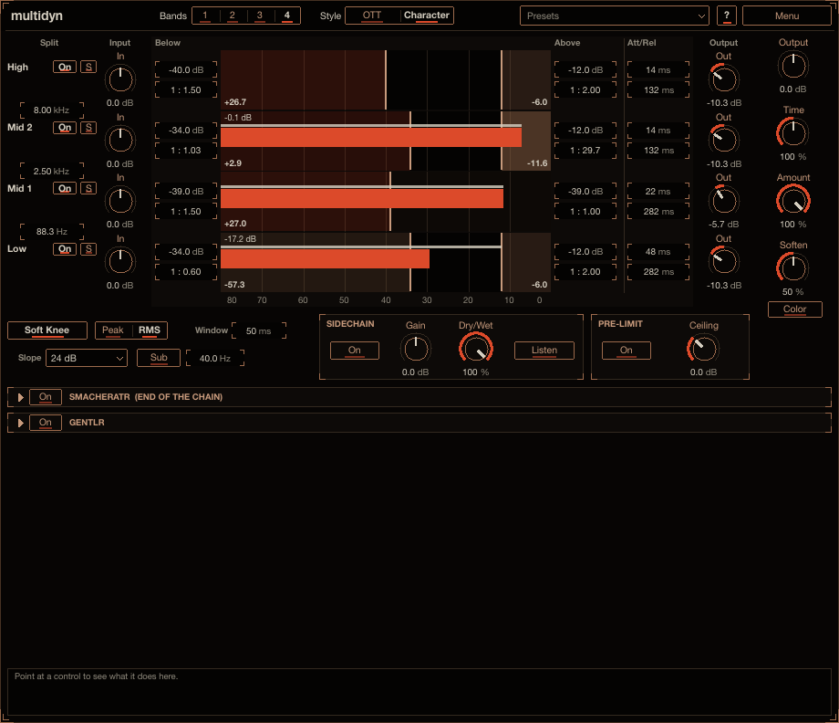
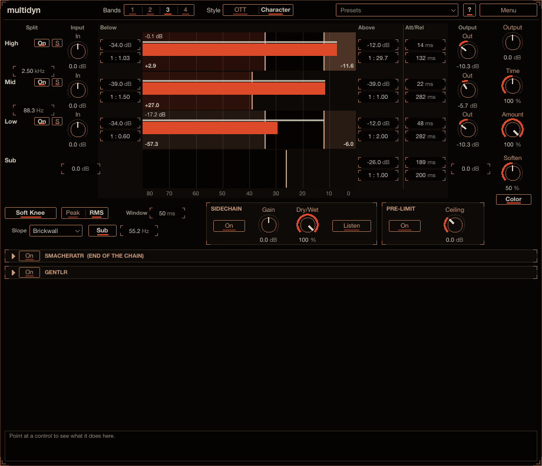
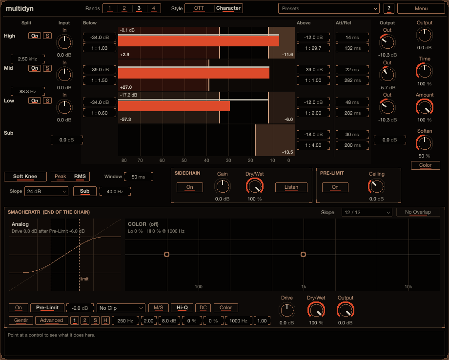

# multidyn

multidyn controls the dynamics of 1 to 4 frequency bands at once. In each band it can hold loud parts
down and bring quiet parts up, so a sound gets denser, louder and more detailed, or it can do the
opposite and open the dynamics up. Reach for it to make a synth, a drum bus or a vocal sound big and
in your face, to tame one band that pokes out, or to duck a band from a side-chain. Install
instructions are in the [top-level README](../../README.md).

## How to use it

1. Put multidyn on a track. It starts in the **OTT** style with three bands, already doing the loud,
   squashed multiband sound.
2. Turn **Amount** down to blend the effect back, and **Time** to make it faster or slower.
3. For finer work, drag the blocks in the display: a block's edge moves its threshold, dragging inside
   a block sets its ratio. **Style** switches to **Character** for a smoother sound.

Point at any control for help in the info box at the bottom (**?** also switches on hover tooltips).

## How the bands work

Each band has two blocks, each with a threshold and a ratio:

| Block | 1 : x with x > 1 | 1 : x with x < 1 |
|---|---|---|
| **Above** the upper threshold | downward compression / limiting (loud gets quieter) | upward expansion (loud gets louder) |
| **Below** the lower threshold | upward compression (quiet gets louder, up to +36 dB) | downward expansion (quiet gets quieter) |

Ratios are written **1 : x**. x > 1 always compresses (shrinks the dynamic range), x < 1 expands, and
**1 : inf** limits.

Each block has its own level envelope: Above uses Attack when the level rises and Release when it
falls, Below the other way round. Attack and Release are the time to reach the new amount of
compression (about 95 % of the change). Because the envelope works on the level, how fast the gain
moves also depends on how far the signal is past the threshold. Upward compression never lifts a
signal past the Below threshold, so hits after silence do not jump.

## Style: OTT or Character

**Style** (top bar, OTT by default) picks how each band's dynamics work.

**OTT** is fast and grainy, the classic over-the-top multiband sound. Its static curves follow a
measured fit of Xfer Records' OTT 1.3.1 (see Credits) to about 0.03 dB, and program material to about
0.1 dB (median). Each band follows its stereo mean square with a one-pole envelope (a fixed attack, a
release that follows Time). The gain law: upward compression at about 4 : 1 below its knee up to a cap
of about 36 dB, an infinite ratio above its downward knee, soft knees, makeup gain and a gain floor.
**Amount** is the depth and **Time** scales the release. The lowest band plays the low band's
settings, the top band the high band's, any between the mid band's (one band alone: the mid band). At
the defaults it is plain OTT; the band controls move it from there:

- a band's **Below** / **Above** threshold moves the upward / downward knee by as much as it moved from
  its default;
- the Below / Above **Ratio** scales that branch's strength by (1 - 1/r) against the default ratio's
  (1 : 1 turns the branch off; under 1 : 1 the Above branch expands, and the boost stops at the upward
  branch's cap, about 36 dB);
- **Attack** / **Release** scale the times by the same factor they moved from their defaults;
- the band **Output** trims after the makeup gain.

**Peak/RMS**, the **RMS Window**, **Soft Knee**, **Soften** and the transient guard only work in
Character and look disabled in OTT. Soften's **Color**, Pre-Limit, the side-chain, the crossovers (24
dB: Linkwitz-Riley 4 in OTT), the Sub band and the smacheratr work in both. In OTT the display's block
numbers show the gain over the makeup.

**Character** is multidyn's own sound. Detection is smooth (the RMS Window, 50 ms by default, and a
rounded onset), the knee is wide (12 dB) and the release slows down up to 3x the deeper the gain
change, so it moves smoothly rather than grabbing peaks.

## Defaults

The defaults are the classic OTT settings in OTT style: 3 bands split at 88.3 Hz and 2.5 kHz (8 kHz for
a fourth), Below -40.8 / -41.8 / -40.8 dB and Above -33.8 / -30.2 / -35.5 dB, 1 : 4.17 below and 1 :
66.7 above on every band, attack / release 47.8 / 22.4 / 13.5 ms and 282 / 282 / 132 ms, Amount and
Time 100 %, Soft Knee and RMS on, 24 dB/oct crossovers. A fourth band starts like the top band of three.
The gain staging (band outputs +10.3 / +5.7 / +10.3 dB, a fourth band +10.3 dB) is built into the
processing, so every Input, Output and band gain control reads 0 dB at the default and trims around
it. Use Amount to dial the processing back.

## Controls

The **Split** column on the left holds the band names (**Low**, **Mid**, **High**, or **Mid 1** /
**Mid 2** with four bands, **Full** with one), **On** (bypasses the band's dynamics and gains) and
**S** (solo), with the crossover frequency fields between the lanes. Then come each band's **Input**
knob, the lanes, each band's **Output** knob, and the global controls on the right.

- **Bands** (top): 1, 2, 3 or 4. 1 makes multidyn a single full-range processor.
- **Style** (top): **OTT** or **Character** (see above).
- **Value fields** beside each lane: Below threshold and ratio (left), Above threshold and ratio and
  **Att/Rel** (right). Drag a field up or down (Shift: fine), double-click to reset.
- **Display**: thin bars are the input level, thick bars the output level. Drag a block edge to move a
  threshold; drag inside a block up (louder) or down (quieter) to set its ratio. **Cmd/Ctrl** = all
  bands, **Alt/Option** = Above and Below together, **Shift** = fine, **double-click** = 1:1. The number
  in a block is the gain it applies at its extreme (silence for Below, 0 dB for Above). **Menu → Reset
  All Ratios to 1:1** clears them all.
- **Global**: **Output**, **Time** (scales all attack and release times), **Amount** (0 % makes every
  ratio act as 1:1), **Soften** and its **Color** on the right. **Soft Knee**, **Peak** / **RMS**
  detection and the RMS **Window** under the display, with the crossovers' **Slope** and the **Sub**
  band's switch and its frequency in the row below.
- **PRE-LIMIT**: **On** and its **Ceiling**.
- **SIDECHAIN**: route another track into inputs 3/4. **On**, **Gain**, **Dry/Wet** (how much the
  side-chain drives the detector) and **Listen**. The status line under the Slope row says whether a
  signal is routed.

**Soften** (top band only): as the top band's Below threshold closes in on its Above threshold, the
part of the signal that upward compression lifts is low-passed and turned down, and the gain changes
are rounded off, so a squashed top band stops sounding noisy and grainy.

**Color** (under Soften, off by default) pushes the highs into a soft saturation curve (a peak at 5 kHz
into smacheratr's Analog curve, taken back down after it), so the loud highs that upward compression
brings up come out rounder. Its amount follows Soften: 15 % at 0, 35 % at 100 %. Switching it
crossfades over 20 ms, so it never clicks, and the latency never changes (off, the output is the plain
signal, to the bit).

**Pre-Limit** (off by default): a 1 ms look-ahead limiter on each band's input (after the band's Input
gain), with its **Ceiling** relative to the band's Above threshold (0 dB = right at it). When you push
hard into the thresholds, a transient would otherwise pass at full level until the attack catches up,
and then get squared off by whatever follows (a saturator). The pre-limiter holds it where the
compressor settles anyway, so it reaches the saturator at the same level as the body. Raise the
Ceiling to let more of the transient through.

**Slope**: the crossovers' steepness, **6 dB**, **12 dB**, **18 dB**, **24 dB**, **36 dB**, **48 dB**,
**60 dB**, **72 dB**, **84 dB**, **96 dB** or **Brickwall**; 24 dB by default. 12 and 24 to 96 dB are
Linkwitz-Riley crossovers, 18 dB a third-order Butterworth, 6 dB a first-order split whose two sides
add up to the input itself, and Brickwall 192 dB/oct (a third of an octave from the crossover a band is
down more than 60 dB). At every slope the bands sum back flat (within 0.1 dB, for any band count) when
nothing is processed; the steeper the slope, the more the phase turns around the crossovers (6 dB turns
none). None of them adds latency, and changing the slope while playing does not click.

**Sub** band (off by default): an extra band below band 1 for the sub region. The input is split at
its frequency (20 to 100 Hz, 40 Hz by default, in the field next to the **Sub** switch) before the other bands, so band 1 no longer gets the
sub, and everything still sums back flat. The Sub band compresses downward only: its **Thresh** (-18 dB)
and **Ratio** (1 : 4) work like a band's Above threshold and ratio, with its own **Attack** (30 ms, long
enough for the sub's slow cycles), **Release** (200 ms), **Input** gain (0 dB, before the compression,
so it drives the threshold harder) and **Output** gain (0 dB). The detector, Soft Knee, Amount, Time,
the side-chain and Pre-Limit work on it as on the bands. It has no Below block and no solo (soloing a
band mutes it). When it is on, the display gets a lane for it at the bottom with its Above block (drag
its edge for the threshold, inside it for the ratio, double-click for 1:1) and its fields beside it;
its Input and Output sit in the Input and Output columns. Off, it does not run at all and the sound is
exactly what it is without it. Switched on or off it fades over 30 ms; the latency stays the same.

**smacheratr** (bottom panel, end of the chain): the saturator every plug-in here can end with, after
the Output gain. Off by default, Drive 0 dB.

Every control is an automatable parameter.

## Presets

The **Presets** menu in the header starts with **Init** (every control at its default) and has these
factory presets: *Dynamics*: Gentle, OTT, OTT Light. Save your own with **Save As...** (a category
and tags are optional), filter the menu by tag, and use **Save as Default** to make every new
multidyn start from the current settings. The menu is described in the [top-level
README](../../README.md#presets).

## Latency

Every band always runs through the 1 ms look-ahead, and the saturator's and Color's oversampling add
their own, so the latency (218 samples at 48 kHz) never changes. It is reported to the host.

## Older projects

Projects saved before Style existed (and smemplr rack slots saved before it) open in Character, so they
sound as they did.

Up to version 0.6 the defaults were a more extreme setting, with its gain staging built in (input +5.2
dB, band outputs +24 / +9.1 / +11.3 / +11.7 dB, output -7 dB). A project saved before loads with the
difference moved into its gain controls (a band 1 Output of 0 dB becomes +13.7 dB, the Output -7 dB,
every band Input +5.2 dB, and so on), so it sounds the same; only a trim that would now go past a
control's range stops at its end. Old projects also start with 24 dB crossovers, Color off and the Sub
band off.

## Credits

The OTT style's constants and laws are David Braun's fit to measurements of Xfer Records' OTT,
published as `co.xfer_ott` in the Faust libraries' `compressors.lib` under the MIT licence
(https://github.com/grame-cncm/faustlibraries/pull/257). The licence text is in
[THIRD_PARTY_NOTICES.md](../../THIRD_PARTY_NOTICES.md). OTT is a product of Xfer Records; multidyn is
not affiliated with or endorsed by Xfer Records.
