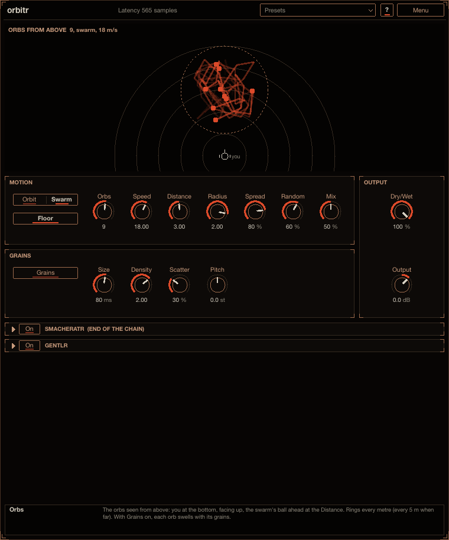

# orbitr

orbitr turns a sound into a swarm. It plays the sound through 1 to 16 virtual sources, the orbs, that
fly around you. Each orb bends in pitch as it moves towards or away from you, the way a passing car
does, and gets louder as it comes close, so a plain sound becomes a moving, shimmering, liquid cloud.
Reach for it on pads, FX, risers, vocal chops and anything that should move around the listener.
Install instructions are in the [top-level README](../../README.md).

## How to use it

1. Put orbitr on a track. By default 6 orbs swarm 3 m ahead of you at 18 m/s, mixed 50 / 50 with the
   input.
2. Raise **Speed** for more pitch bend, lower **Distance** to bring the swarm closer, and pick
   **Orbit** for circles instead of **Swarm**.
3. Use **Mix** to set how much of the orbs you hear against the input.

Point at any control for help in the info box at the bottom (**?** also switches on hover tooltips).

## Controls

The sound (both channels summed) is played by **Orbs** virtual sources moving round a listener, each
heard through its own variable delay line. So its pitch follows its speed towards or away from the ears
(true Doppler: the delay is the time the sound takes from where the orb was when it left it, so the
shift is the moving-source f c / (c + v), c = 343 m/s) and its level follows its distance (Distance /
distance, at most +12 dB).

**MOTION**

- **Orbit** / **Swarm**: **Orbit** moves the orbs in circles round a centre; **Swarm** (the default)
  moves each orb on its own smooth path inside a ball round the centre.
- **Floor** (on): each orb's reflection off the floor (an image source 1.7 m under the ears, 0.4 x).
- **Orbs** (1 to 16, 6 by default).
- **Speed** (0 to 80 m/s, 18 by default), **Distance** (0.5 to 20 m, 3: the centre ahead of the
  listener), **Radius** (0.1 to 3 m, 2: how far from the centre the orbs move).
- **Spread** (80 %): from centred to equal-power panning by each orb's direction. It also sets the ears'
  spacing (8.75 cm each side at 100 %), so the time difference between the ears.
- **Random** (Randomness, 60 %): in Orbit, each orbit's tilt, size, speed and place; in Swarm, the
  spread of the paths' rates.
- **Mix** (50 %): the orbs against the input.

**OUTPUT**: **Dry/Wet** (100 %: the whole effect against the input, lined up in time) and **Output**
(-24 to +12 dB).

The orbs are summed / sqrt (Orbs), so the swarm stays about as loud as the input whatever their number.
The delays are read with 4-point Hermite interpolation and worked out every 16 samples (ramped in
between).

The display shows the orbs from above, with their trails: you at the bottom, facing up, the swarm's ball
ahead at the Distance, rings every metre (every 5 m when far).

**smacheratr** (bottom panel): the saturator every plug-in here can end with (off, Drive 0 dB).

## Presets

The **Presets** menu in the header starts with **Init** (every control at its default) and has these
factory presets: *Motion*: Dense Swarm, Slow Orbit, Subtle Shimmer. Save your own with **Save
As...** (a category and tags are optional), filter the menu by tag, and use **Save as Default** to
make every new orbitr start from the current settings. The menu is described in the [top-level
README](../../README.md#presets).

## Latency

The delays are taken relative to the centre: a source at the centre is 10 ms late, so orbitr's own
latency is a constant 10 ms (480 samples at 48 kHz) whatever the settings; the input in Mix and Dry/Wet
is delayed as much. With the end saturator's (always in the path, so it never changes) it is reported to
the host for automatic compensation.

## CPU

The defaults take about 7 % of one core at 48 kHz stereo; 16 orbs about 12 % (measured as process CPU
time, the best of three runs, on the build machine, the saturator on).
