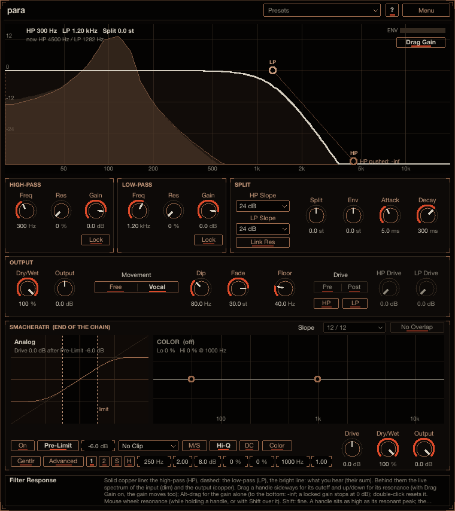
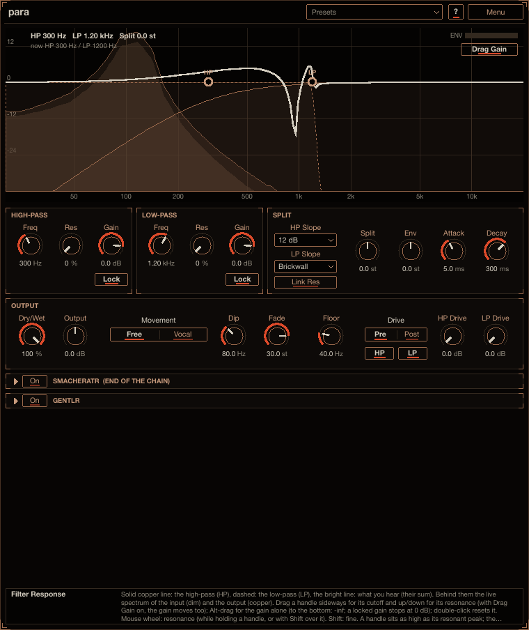

# para

para runs a high-pass and a low-pass filter side by side and adds them together. Set together they
change nothing; pull them apart and a notch opens between them, which you can sweep, widen, fire from
MIDI notes, or drive. The **Vocal** movement makes one filter lead and fade the other out, for liquid,
talking bass movement. Reach for it on basses and reese sounds, for filter sweeps and transitions, or
to scoop the middle out of a sound. Install instructions are in the
[top-level README](../../README.md).

## How to use it

1. Put para on a track. By default the high-pass sits at 300 Hz over the low-pass at 100 Hz, which
   leaves a notch between them.
2. Drag the handles in the display: sideways for the cutoff, up and down for the resonance. With **Drag
   Gain** on (the button on the display) the gain moves with the handle; Alt-drag moves the gain alone.
3. Automate **Split** or the cutoffs for movement, or route MIDI to para and set **Env** to open and
   close the notch on every note. Try **Movement**: **Vocal** while you sweep.

Point at any control for help in the info box at the bottom (**?** also switches on hover tooltips).

## How it works

The two filters run in parallel and their outputs are summed. With the high-pass above the low-pass
that leaves a notch between them; with the two meeting (resonance 0) the sum is flat, so nothing
happens; pushing them further apart widens the notch. The pairs are chosen so they meet flat at every
slope: first order at 6 dB, Linkwitz-Riley at 12, 24 and 36 to 96 dB, a quadrature Butterworth pair at
18 dB, and at Brickwall a 13th-order elliptic pair that is doubly complementary.

## Controls

- **HIGH-PASS** / **LOW-PASS**: each filter's **Freq**, **Res** and **Gain**, from -inf (only the other
  filter is heard) to +12 dB, and under the gain its **Lock**. With a filter's Lock on, its gain never
  goes above 0 dB: the knob and the display's handle (Drag Gain and Alt-drag too) stop at 0 dB,
  switching the Lock on brings a higher gain down to 0 dB, and the engine caps the gain at 0 dB whatever
  the parameter says (automation included). The high-pass's Lock is on by default, the low-pass's off.
- **SPLIT**:
  - **HP Slope** and **LP Slope**, a drop-down each (click for the list, or scroll over it): **6 dB**,
    **12 dB**, **18 dB**, **24 dB** (the default), **36 dB**, **48 dB**, **60 dB**, **72 dB**, **84 dB**,
    **96 dB** or **Brickwall** (-3 dB at the cutoff, 40 dB down a tenth of the way past it, 80 dB down
    from 0.8 x the cutoff on: 1.25 x for the low-pass). Resonance raises the sections' Q; from 36 dB on
    it is spread over the sections so the peak at the cutoff is as high as at 24 dB. 6 dB and
    Brickwall, which have no section to raise, get a resonant bell at the cutoff instead (up to +26
    dB). With both slopes the same, the two filters meeting at one frequency sum flat; with different
    slopes they do not, and the display draws the sum as it is. A new slope crossfades from the old one
    over 10 ms, so switching never clicks (a tone where both filters sound can dip for those 10 ms).
  - **Link Res**: the low-pass uses the high-pass resonance.
  - **Split**: moves the filters apart or together, in semitones. Automate it, or use the envelope.
  - The envelope, triggered by every MIDI note: **Env** amount, **Attack**, **Decay**.
- **OUTPUT**: **Dry/Wet**, **Output** and **Movement**:
  - **Free**: the filters move independently.
  - **Vocal**: the filter you moved last leads. A low-pass swept up past **Dip** (80 Hz by default)
    takes the high-pass up with it and fades it out; a high-pass swept down past the low-pass pushes the
    low-pass down and fades it out from the crossing. So one filter ends up sweeping alone. The fade runs
    over **Fade** semitones (30 by default, 1 to 60), evenly in dB: from 0 dB in a straight line towards
    -36 dB at the end of the Fade, and over its last 10 % also under a raised-cosine half window, so it
    is silent at the end and past it. The gain is smoothed (20 ms), so a sweep never steps. Split also
    swings with the sweep: the filter you move overshoots the way it moves and flows back when it
    stops. **Floor**: the low-pass never goes below it (40 Hz by default), so the sub stays.
- **Drive** (in OUTPUT): a drive in each filter's branch, smacheratr's Analog curve, 4x oversampled.
  Each has its own switch (**HP**, **LP**) and amount (**HP Drive**, **LP Drive**: 0 to +36 dB into the
  curve), so the lows and the highs saturate apart (a loud bass does not bend the top) or only one of
  them does. **Pre** (the default) drives each filter's input, so the filter shapes what its drive adds
  (the low-pass takes the top harmonics away); **Post** drives each filter's output (before its gain), so
  the harmonics stay. The dry part of Dry/Wet is never driven. The drives delay the sound by the same
  small amount on or off, Pre or Post (37 samples at 48 kHz), so the latency never changes; moving them
  between Pre and Post fades the sound out and back in for about 10 ms. Both drives on, stereo, take
  about 1.5 % of a core.
- **smacheratr** (bottom panel): the saturator every plug-in here can end with (off, Drive 0 dB). While
  it is off it folds to its header strips; click a strip (or switch it on) to open it. See
  [smacheratr](../smacheratr/README.md#at-the-end-of-the-other-plug-ins).

## The display

The Filter Response display shows the high-pass (a solid copper line, HP), the low-pass (dashed, LP) and
what you hear (the bright line), over live spectra of the input (dim) and the output (copper). The curves
are the digital filters as they are (they bend near the top of the spectrum). A handle sits at each
cutoff, as high as its resonant peak: drag it sideways for the cutoff and up and down for the resonance;
with **Drag Gain** on the gain moves with it; Alt-drag moves the gain alone (to the bottom: -inf);
double-click resets it. With audio running the display adds everything the engine does to the settings
(envelope, glide, Vocal), so edits show at once; the handles glow with the envelope and the ENV meter
shows it.

The cutoffs do not follow the notes: MIDI notes only trigger the Split envelope (route MIDI to the
plug-in for that). para is also in smemplr's effects rack.

## Presets

The **Presets** menu in the header starts with **Init** (every control at its default) and has these
factory presets: *Filter*: Narrow Notch, Vocal Movement, Wide Scoop. Save your own with **Save
As...** (a category and tags are optional), filter the menu by tag, and use **Save as Default** to
make every new para start from the current settings. The menu is described in the [top-level
README](../../README.md#presets).

## Older projects

- Projects saved with the three slopes of before (12 / 18 / 24 dB) keep their slope.
- Projects from before the drive was per filter had one drive for both: they open with both drives as
  that one was (on, amount, Pre or Post). With Dry/Wet at 100 % (the default) Pre sounds as before;
  Post drove the sum of the filters and now drives each filter apart, which differs where both filters
  sound at once.
- Projects saved before the separate slopes open sounding the same: the low-pass gets the slope both
  filters had, the high-pass's Lock is on unless the saved high-pass gain is above 0 dB (then off), the
  low-pass's is off, and Fade keeps the semitones it was saved with (an instance that never changed it
  keeps 12 semitones). The fade's shape is now the even-in-dB one described above.
