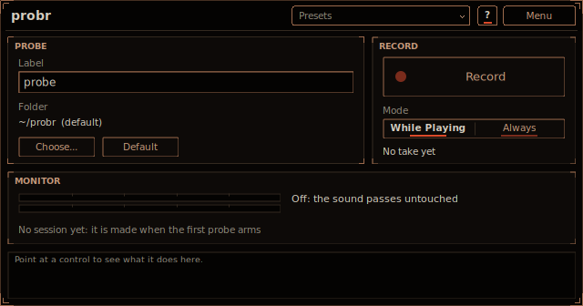

# probr

probr is an analysis probe. Insert it between two devices and it records exactly what passes through
that point of your chain while the song plays, along with the song position, the tempo and any MIDI it
gets. Put one after each stage you want to understand, play the section, and
[scripts/probr_align.py](../../scripts/probr_align.py) lines all the probes up beat by beat and tells
you what each stage did: its level, its spectrum, its stereo width and how peaky its harmonics are,
stage by stage. The sound itself passes through untouched: bit for bit, with no latency, armed or not.
Install instructions are in the [top-level README](../../README.md).



Everything stays on your computer. probr writes files into a folder you choose and never sends
anything anywhere.

## Walkthrough in Ableton Live

1. **Insert a probr after each device or rack chain you want to understand.** On a bass track with an
   instrument, an EQ, a Trash and a compressor, for example: one probr after the instrument, one after
   the EQ, one after the Trash, one after the compressor. probr works inside racks too: drop it into a
   chain of an Audio Effect Rack or an Instrument Rack, after the device you want to hear, to record
   that chain on its own.
2. **Label each one.** Click **Label** and type where it sits, such as `1 synth`, `2 after EQ`,
   `3 after Trash MIDS`, `4 after comp`, then press Return. The label names its files. Numbering the
   labels in chain order lets the script put them in that order by itself.
3. **Arm them all.** Click **Record** on each one: it reads **Armed**. With **Mode** at **While
   Playing** (the default) nothing is written yet.
4. **Play the section.** Every probr turns red (**Recording**) while the song plays and writes a take.
   Stop, and each one closes its take; play again and each starts a new one. Loops and jumps are fine:
   the time map follows them.
5. **Switch Record off** on each probr when you are done (or leave them; a project always opens with
   every probr off).
6. **Zip the session folder.** The **MONITOR** section shows where the takes went:
   `<folder>/<session>/`. The session folder is named by the date and time the first probr armed, and
   every probr of that Live session writes into it. Zip that folder to analyse it or to send it to
   someone (it is a lot of audio: about 23 MB per probe per minute at 48 kHz).

Then run the script on it (below).

## Controls

| Control | What it does |
|---|---|
| **Label** | The probe's name: its files are `<label>_<take>.wav` and so on. Saved with the project. Characters a file name cannot hold become `_`. Give each probr in a session its own label (two with the same label do not overwrite each other: their takes get the next free numbers). |
| **Record** | **Off** or **Armed**. Armed, the button turns red and reads **Recording** while a take is written. Not saved: a project or a preset always opens with the probe off, so nothing records until you arm it. |
| **Mode** | **While Playing**: records only while the song plays, a new take at every play start. **Always**: one take from arming until Record goes off, whether the song plays or not (for a live input, or a host that gives no song position). |
| **Folder** | Where the sessions go. The default is `Documents/probr` on macOS and Windows and `~/probr` on Linux. **Choose...** picks another folder, **Default** goes back to the default one. Saved with the project (the default folder is saved as "the default", so a project opened on another computer uses that computer's). |

**MONITOR** shows the level passing through (left and right), what the probe is doing, the free disk
space while it is armed, and the session folder with the last file written. **RECORD** shows the take
being written, its length and how many takes the probe has written.

Point at any control for help in the info box at the bottom (**?** also switches on hover tooltips).

## What a take holds

In `<folder>/<session>/`, for each take:

- `<label>_<take>.wav`: 32-bit float stereo at the host's sample rate, the samples exactly as they
  passed through (bit for bit, including anything over 0 dBFS).
- `<label>_<take>.json`: the label, the session, the take, the sample rate, the tempo and time
  signature at the start, where the take started in the song, why it ended, and the **time map**.
- `<label>_<take>.midi.json`: the MIDI that came in, when some did: note on, note off and pitch bend,
  each with its sample in the take and its song position (ppq).

Takes are numbered from `001`; a take never overwrites a file that is already there.

**The time map** ties every sample to the song. Each entry is `[sample, ppq, bar_start, tempo,
playing, ts_num, ts_den, project_sample]`: at `sample` (counted from the take's first sample) the
song was at `ppq` (quarter notes from the song's start), the bar started at `bar_start`, and so on.
There is an entry at the take's start, then every 512 samples (inside a block too, worked out from
the block's start), and at the start of any block where the song does not go on as the last entry says: a loop or a jump, a tempo or time signature change, play or stop. An entry holds until
the next one: while playing, `ppq(s) = ppq + (s - sample) / sample_rate * tempo / 60`; stopped, the
ppq stays. That is how probes armed at different moments, takes split by stopping, and loops all land
on the same beats.

## MIDI (optional)

probr has a MIDI input. Anything routed to it is written beside the audio, so the analysis can look
at each note (how peaky its harmonics are). It is optional: without it probr records the audio and
the time map as always. One probe with the MIDI is enough: all probes share the timeline, so the
script analyses every probe's audio at the notes it finds on any of them.

In Ableton Live:

1. Create a MIDI track next to the instrument's track.
2. Set its **MIDI From** to the instrument's track and its **Monitor** to **In** (or copy the
   instrument's clips onto it).
3. Set its **MIDI To** to the track that holds the probr, then pick the probr in the chooser under it.
   Live lists the plug-ins on that track that take MIDI. If a probr deep in a rack is not listed,
   route the MIDI to a probr that is (one on the track itself, for example).

Pitch bend arrives as Live sends it to plug-ins (VST3 passes pitch bend as a parameter: probr maps
it per channel), sample-accurate. Other controllers are not recorded.

## Problems

probr never touches the sound to deal with a problem, and never waits in the audio thread: the audio
thread only copies samples into a buffer, and a separate thread writes the files.

- **Disk space.** Armed, probr shows the free space where the takes go. Below 2 GB it shows a warning;
  below 256 MB it stops the take cleanly (the WAV and the JSON are closed, the JSON says it ended
  because the disk was full) before the disk is actually full. A disk that fills up anyway (another
  program, a quota) stops the take the same way.
- **The disk cannot keep up.** probr buffers about three seconds of audio. If the disk falls that far
  behind, the take stops cleanly at the last whole block and probr says so.
- **The folder cannot be written.** probr says so and records nothing.

After a problem the probe reads **Stopped** with the reason under it: switch **Record** off and on to
record again.

Other limits: a take stops at 4 GB (about three hours at 48 kHz); the WAV is always stereo; with
**While Playing** a host that gives no song position never records (probr says so: use **Always**).
probr follows the transport the host reports to plug-ins, so in Live a probr on a track that Live is
not processing (a frozen track, for example) records nothing.

## The analysis: scripts/probr_align.py

```sh
python3 scripts/probr_align.py ~/probr/2026-10-08_14-03-22
python3 scripts/probr_align.py SESSION --order "1 synth,2 after EQ,3 after Trash MIDS" --grid 16 --range 32 64
```

It needs Python 3 and numpy. It reads every take of the session, places each sample on the song's
timeline by its time map (only what was recorded while the song played counts), puts the takes of
one label together as one probe, and writes into `SESSION/analysis` (or `--out`):

| File | What is in it |
|---|---|
| `timeline.json` | The probes in order, their takes and the song positions they cover, and the range all of them cover. |
| `<probe>.levels.csv` | Per 1/16 beat (`--grid`): RMS, peak, mid, side, side minus mid (dB) and the left/right correlation. |
| `<probe>.spectra.csv` | Per beat: the third-octave band levels from 25 Hz to 20 kHz of the mid signal and of the side signal. |
| `<probe>.notes.csv` | Per MIDI note: its level, how peaky its harmonics are (the harmonics' peaks over the floor between them, dB), the share of its power at the harmonics and its first harmonics' levels. |
| `<probe>.analysis.json` | All of the above in one file. |
| `diff_<B>_minus_<A>.*.csv` | Each probe minus the one before it in the order, on the bins, beats and notes both have: what stage B did to the sound of stage A. |
| `compare.json` | Per pair: the mean difference of level, mid and side, per band and in peakiness. |

The order is `--order` (labels or file names), else the labels sorted naturally, so `1 ...`, `2 ...`,
`10 ...` come in that order. A probe armed later, or a take that covers only part of the song, is
compared on what it shares with the others. When the same part of the song was played more than once
(a loop), each bin, beat or note averages every pass.

## How it works

```
input -> output (copied, untouched)
      \-> armed: ring buffer (lock-free) -> writer thread -> WAV, JSON, MIDI JSON
```

The audio thread copies each block into a lock-free single-producer, single-consumer ring (about
three seconds of stereo audio at the host's rate, allocated before processing starts), with a
record of the song position when it is due and the block's MIDI. It never allocates, locks, waits or
touches a file. A writer thread drains the ring every couple of milliseconds and writes the files:
the WAV as it goes (its header updated every second, so even a crash leaves a WAV that opens), the
JSON when the take ends. When the ring has no room for a block (the writer fell behind), the take
ends right there; the record of its end always fits, because room for it is kept free.

All probes in one host process share the session: the first one to arm makes the session id, and
every other probe in the process joins it. Hosts that run each plug-in in a process of its own are
covered by a small file in the folder, `.probr-session`, which says which session was used last and
when: a probe in another process joins a session used in the last two minutes.

## Tests

`probr_tests` (the ring; the pass-through bit for bit, recording or not, in place or not; the WAV the
input bit for bit; takes split on play and stop; the time map's ppq through a loop and a tempo change;
MIDI; one session folder for every probe and no file overwritten; no drops at 192 kHz with the writer
thread; a full disk, a disk below the space kept free, a folder that cannot be written and a writer
that falls behind, on a fake file system; the CPU of the audio thread's part), `probr_state_tests`
(the saved state, and the VST3 processor's pass-through and recording without a host),
`probr_align` (the script on generated sessions and on one the writer made), the draw bench's layout
check, and `probr_hosttest` on macOS.
