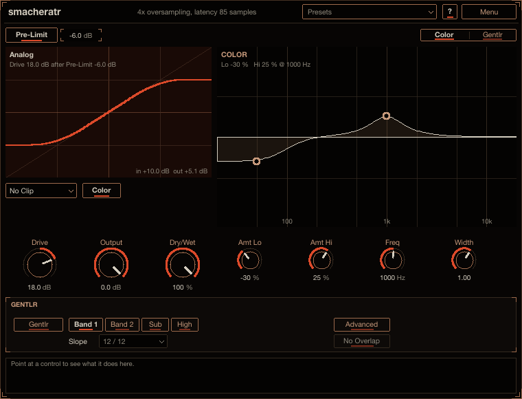
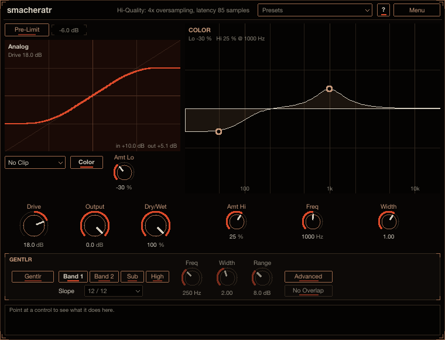
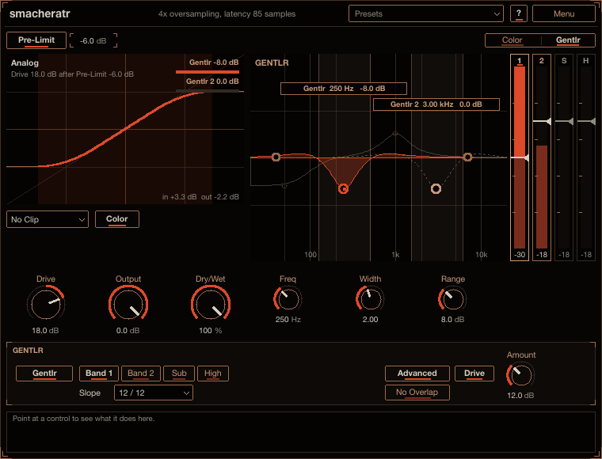

# smacheratr

smacheratr adds saturation, from a little warmth or grit to hard clipping. Use it to make a bass, a
drum bus or a synth sound thicker and louder, or to catch peaks with a soft clip. Its pre-limiter keeps
transients from being squared off harder than the rest of the sound, its colour filters let you choose
which frequencies get dirty, and its gentlr keeps a hard-pushed sound from going muddy or harsh. Every
other plug-in in the suite can end with the same smacheratr. Install instructions are in the
[top-level README](../../README.md).

## How to use it

1. Put smacheratr on a track and turn up **Drive**. The curve display shows how far the signal reaches
   into the saturation; drag the display up or down to set Drive too.
2. Keep **Pre-Limit** on (the default) so transients do not clip harder than the body. Pick a **Post
   Clip** mode to keep the output under 0 dBFS, and use **Dry/Wet** to blend.
3. If the sound gets boomy or harsh, switch on **gentlr** in the GENTLR panel. To saturate the bass less
   than the rest, use **Color** and **Amt Lo**.

Point at any control for help in the info box at the bottom (**?** also switches on hover tooltips).

## The curve

Every sample is shaped by the **Analog** curve: linear up to half scale, then a smooth knee into
clipping at 0 dB. **Drive** (-36 to +36 dB, 0 dB by default) sets how far the signal reaches into it.
At 0 dB only peaks past half scale are shaped. The display shows the curve with the driven signal's
current reach highlighted, so you can see where the saturation starts.

**Pre-Limit** (on by default) is a look-ahead limiter in front of the drive: the input is held at its
threshold (the value next to the Pre-Limit switch, -6 dB by default) and the drive is applied after it. A transient then cannot
push further into the curve than the rest of the sound, so it is not squared off. The display shows the
furthest the driven signal can go as dashed lines.

**Post Clip** (**No Clip** / **Soft Clip** / **Hard Clip**) clips the output at 0 dB after the curve, so
the output never goes over the **Output** level (-36 to 0 dB). With Soft Clip and Hard Clip nothing
leaves above 0 dBFS at all (Soft clips more gently on the way there). Some stages after the curve can
rise over it again (the Hi-Quality downsampling filter overshooting by up to 4 dB, gentlr's bands, the
dry part of a mix, Mid/Side going back to left and right: up to 6 dB), so the very end, after Output, is
held to 0 dBFS too; only those overshoots are cut. **Dry/Wet** blends in the dry signal; use 100 % on a
return track.

**Color** (on by default) adds two filters before the curve and undoes them after it. They change how
much of each frequency range is saturated without changing the balance of the output: with **Amt Lo** at
-100 % the bass stays clean and passes through, while the mids and highs saturate. **Amt Hi** does the
same around **Freq**, with the bandwidth set by **Width**. The Colour EQ display shows the EQ before the
curve; drag the left handle for Amt Lo, the right handle up and down for Amt Hi or sideways for Freq.

## gentlr

gentlr keeps a hard-pushed drive from going muddy or harsh. Switch it on with **gentlr** in the GENTLR
panel. It has four bands, chosen with **Band 1**, **Band 2**, **Sub** and **High**. Each turns its
region down only while that region is loud: before the curve when the band hits it hard, and after it
by half as much. The cut is 3 dB for every 5 dB the band is over -18 dBFS, at most the band's **Range**,
so it does nothing at gentle settings.

- **Band 1** sits on the low mids (250 Hz, Range 8 dB by default). **Band 2** has a Range of 0 dB to
  start with: give it a Range to use it. Set each with **Freq**, **Width** and **Range**, or in the
  Colour EQ display: drag a band's handle sideways for the frequency and down for the Range, drag an
  edge (or hold Alt / Option and drag the band sideways) for the width. A band whose edge reaches an end
  of the spectrum (20 Hz or 20 kHz) becomes a shelf there, running flat past that end.
- **Sub** compresses the sub region: a shelf, flat from the bottom of the spectrum up to its **Freq** (20
  to 100 Hz, 40 Hz by default), where its cut lets go (nearly none two octaves up). It has no width.
- **High** does the same for the top (harshness, fizz, sibilance): a shelf, flat from its **Freq** (2
  to 16 kHz, 7 kHz by default) to the very top, its cut letting go below it (about half of it an octave
  down, nearly none two octaves down, so at 7 kHz the presence region of 1 to 3 kHz is left alone). It
  is the complement of a critically damped 12 dB/oct low-pass, so its cut is exactly the Range where it
  is flat. No width.
- The Sub and High bands have no switch of their own. They are always there, start at Range 0 dB (no
  cut, the handle flat at 0 dB) and work once you pull their handle down or raise their Range. At
  Range 0 dB gentlr sounds exactly as it does without them, bit for bit.

**Slope** (under the band selector; one setting for Band 1 and Band 2, the Sub and High bands keep
their own shape) sets the shape of the two bands:

- **12 / 12** (the default): 12 dB/oct below the band and 12 dB/oct above it. The band is symmetric, so
  at its centre the cut is exactly the Range.
- **Signature**: 24 dB/oct below, 12 dB/oct above. A steeper floor under the band, so a band on the low
  mids leaves the bass under it alone.
- **Classic**: 12 dB/oct below, 6 dB/oct above, the only shape before Slope existed.

Every band is scaled to peak at 0 dB, a band at an end of the spectrum is still a shelf there, and the
display draws the shape selected. The end saturator in the other plug-ins has the same Slope (above its
Colour EQ display).

**No Overlap** (off by default): gentlr's working bands never cover the same frequencies. Dragging or
widening a band in the display pushes its neighbours' edges along (a neighbour narrows, and once it is
0.5 octaves wide moves as a whole); where a neighbour cannot move further (Sub at 20 Hz, High at 16
kHz) the dragged band stops. Switched on, bands that overlap are split at the middle of the overlap.
Automation that makes them overlap is kept apart the same way, and bands that do not overlap are left
exactly as they are.

**Glue** (nothing glued by default): drag a band's edge (or the Sub or High band's handle) onto its
neighbour's edge in the display. Within a few pixels it snaps on, and when you let go the two are glued
at that border. A small link icon sits on the border near the bottom of the display: copper where two
bands only touch, lit cinnabar while they are glued. While glued, dragging the shared border moves both
edges (one band gets wider as the other narrows; for the Sub and High bands their Freq is the border),
and moving one band drags its neighbour's edge along. Click the link icon to detach them (they stay
where they are), or click it on two bands that touch to glue them. Band 1 and Band 2, Sub and either
band, and either band and High can be glued; each pair is a parameter of its own (**gentlr Glue 1 /
2**, **gentlr Glue Sub / 1** and so on), saved with the project. The glue holds under automation too
(the lower band leads; the High band leads the band under it). Where glue and No Overlap disagree, No
Overlap wins.

**Advanced** gives each band a **Threshold** instead of the fixed -18 dB: a vertical slider per band at
the right edge of the display, with the band's level rising beside it (bright where it is over the
threshold, where the band is being cut). Over the threshold the law is the same: 3 dB of cut for every 5
dB over (2.5 : 1, hard knee), reaching the Range (Range / 0.6) dB over it.

Advanced also has the region **Drive** (and its **Amount**, 0 to 36 dB): the bands gentlr works on are
split out again, put through the Analog curve on their own and added back, level-matched, so the cut
region gets density and harmonics while the rest of the sound stays clean. It runs oversampled with the
rest when Hi-Quality is on, fades in and out when switched, and does not change the latency. With
Advanced off, every band starts cutting at -18 dB.

## Menu

- **Hi-Quality (4x oversampling)** (on by default) runs the curve 4x oversampled (two linear-phase
  half-band stages) to keep aliasing down.
- **Pre-DC Filter** removes DC offset before the curve.
- **Mid/Side** saturates the mid and the side apart, so the side is driven by its own, lower level and
  a wide sound stays wide when you push the drive. (widr's end saturator always works this way.)
- **Interface Size**, **Copy Settings** / **Paste Settings**.

## Latency

About 1.7 ms (83 samples at 48 kHz: the pre-limiter's 1 ms look-ahead plus the oversampling), the same
whatever the settings, and reported to the host.

## Older projects

gentlr was called Clarity. Projects saved before Slope existed load with **Classic** and sound exactly
as they did. Projects saved while the Sub and High bands had switches sound the same: a band that was
off loads at Range 0 dB, one that was on keeps its Range. Projects saved before glue load with nothing
glued.
