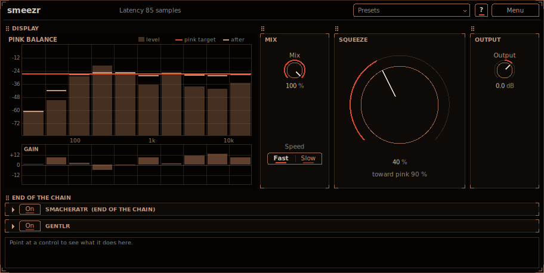

# smeezr

smeezr is a one-knob compressor. Turn up **Squeeze** and the sound is first squeezed towards the tonal
balance of pink noise: every octave is pulled towards the same loudness, so a dull sound gets brighter, a
harsh one darker and a boomy one tighter, while the overall loudness stays where it was. Past the middle
of the knob an OTT-style boost comes in on top: quiet details come up, peaks go down, and at 100 % the
sound is at its most squashed. Material at a normal level gets much louder; material that is already very
loud is held at about the same level, since the boost pulls everything towards the same loudness. At 0 it does nothing at all. Install instructions are in the
[top-level README](../../README.md).



## How to use it

1. Put smeezr on a track, a bus or a loop. It starts at **Squeeze** 40 %: most of the way towards the
   pink balance, no OTT boost yet.
2. Turn **Squeeze** down for a gentler pull or up to 50 % for the full pink balance. Watch the display:
   the copper bars are the level of each octave, the cinnabar line the pink target they are pulled to.
3. Go past 50 % for the OTT boost on top. Quieter material gets louder as you turn (already loud material
   stays about as loud), so use **Output** to match levels when you compare.
4. Use **Mix** to blend in the untouched sound (parallel compression), and **Speed** (Fast or Slow) to
   choose how quickly the pink stage follows the music.

Point at any control for help in the info box at the bottom (**?** also switches on hover tooltips).

## The knob

**Squeeze** is one sweep in two halves:

| Squeeze | What happens |
|---|---|
| 0 % | Nothing: the input comes out bit for bit (only delayed by the end saturator's latency). |
| 0 to 50 % | Towards pink: the pink amount goes from 0 to 100 % (on an S-curve: half way at 25 %). |
| 50 to 100 % | The pink amount stays at 100 % and the OTT boost goes from 0 to 100 % (half way at 75 %). |

Both halves are flat where they meet, so there is no jump or kink at 50 %. The knob glides (30 ms), so
turning or automating it never clicks, and leaving 0 fades the processing in over 20 ms. The readout
under the knob says where it is: "toward pink" with the pink amount, or "pink + OTT boost" with the boost.

The knob is labelled **Squeeze** because that is what both halves do: the first squeezes the spectrum
(the octaves' levels towards each other), the second squeezes the dynamics (quiet and loud towards each
other). It is also the word the name comes from.

## How it works

```
input -> 10 bands (Linkwitz-Riley 4, one octave each, 20 Hz .. 20 kHz)
      -> per band: pink gain + OTT gain (its band group)
      -> bands summed -> Mix (dry / wet) -> Output -> smacheratr (the end saturator)
```

**The bands.** Nine Linkwitz-Riley 4 crossovers (24 dB per octave) split the sound into ten bands of one
octave each, log-spaced from 20 Hz to 20 kHz (borders at 40, 80, 159, 317, 632 Hz, 1.26, 2.52, 5.02 and
10.0 kHz). The lower bands go through the all-passes of the splits above them, so with no gain the bands
add up to the input with only a phase shift: flat within 0.0001 dB.

**Towards pink.** Pink noise has the same power in every octave. smeezr measures each band's short-term
level (RMS over 250 ms in the lowest band down to 60 ms in the highest, four times as long at Slow) and
works out the level each band would have if the total power were shared out equally, as in pink noise.
Each band's gain is the difference times the pink amount:

- at most 15 dB of cut or boost (6 dB of boost in the lowest band, 20 to 40 Hz, against rumble, and 12 dB
  in the highest, 10 to 20 kHz, against hiss);
- a band more than 30 dB below the loudest band gets less boost, and 40 dB below none at all (nor does it
  count in the share), so silence and near-silent bands are never pulled up; below -80 dBFS in total
  every gain glides back to 0 dB;
- all the gains are then moved up or down together so the total power, and with it the loudness, stays
  the same;
- the gains glide: cuts at half the band's RMS time, boosts at one and a half times it.

Each band is compared with the total measured over its own time window, so a sound swelling or fading
does not read as a change of balance (the lows' longer windows lag behind the highs').

Both channels are measured together (the mean of left and right squared) and get the same gain, so the
stereo image stays as it is. Mid/side processing would let the sides drift to a balance of their own,
which is not what a tonal balance is about.

**The OTT boost.** The bands are grouped as OTT's three: below 80 Hz, 80 Hz to 2.5 kHz and above 2.5 kHz.
Each group's power after the pink gains goes through multidyn's OTT model (its OTT style,
`plugins/multidyn/src/core/Ott.h`, reused as it is) at OTT's default Time: its envelope (a fast attack, a
short release), its upward branch (about 4:1 below roughly -46 dB, up to about 36 dB), its downward
branch (an infinite ratio above roughly -35 to -42 dB) and its own automatic makeup, all at the depth the
knob gives. Like OTT it brings up very quiet sound a lot, so noise in the gaps comes up too at high
settings.

**Mix** blends with the same all-passed dry signal (the bands summed with no gain), so there is no comb
filtering at any setting.

## Controls

**SQUEEZE**

- **Squeeze** (0 to 100 %, 40 % by default): the one knob (see above).

**MIX**

- **Mix** (100 %): the effect against the untouched input.
- **Speed** (**Fast** or **Slow**, Fast by default): how quickly the pink stage follows the music. Fast
  rides each band like a compressor; Slow takes four times as long and acts more like a moving EQ. The
  OTT boost keeps its own timing.

**OUTPUT**

- **Output** (-24 to +12 dB, 0 by default): the overall level after everything but the end saturator.

**smacheratr** (bottom panel): the saturator every plug-in here can end with (off, Drive 0 dB). While
it is off it folds to its header strips; click a strip (or switch it on) to open it. See
[smacheratr](../smacheratr/README.md#at-the-end-of-the-other-plug-ins).

## The display

The display shows the ten bands, 20 Hz to 20 kHz:

- the copper bars: each band's measured level (dBFS);
- the cinnabar line: the pink target, every band's equal share of the power;
- the pale marks: where the gains put each band;
- the **GAIN** lane under them: the pink stage's gain for each band (a bar), and past 50 % the total with
  the OTT boost (a cinnabar mark).

The grid is drawn once and kept; the levels are drawn over it only when one of them changed, and half a
second after the input goes quiet the display stops following the levels.

## Presets

The **Presets** menu in the header starts with **Init** (every control at its default) and has these
factory presets: *Basic*: Full Pink, Gentle Pink; *Loud*: Halfway, OTT Smash; *Subtle*: Glue. Save your
own with **Save As...** (a category and tags are optional), filter the menu by tag, and use **Save as
Default** to make every new smeezr start from the current settings. The menu is described in the
[top-level README](../../README.md#presets).

## Latency

smeezr adds no latency of its own (its crossovers are minimum-phase filters working sample by sample).
The end saturator is always in the path, so switching it on or off never changes the latency, and its
latency is reported to the host for automatic compensation: 85 samples at 48 kHz at 4x **Oversampling**
(the default), 80 at 2x and 48 (its 1 ms look-ahead) with Off; changing it changes the latency, and the
host is told.

## CPU

The defaults take about 2 % of one core at 48 kHz stereo; **Squeeze** at 100 % with the end saturator on
about 4 % (measured as process CPU time, the best of three runs, on the build machine).

## Credits

The OTT boost uses multidyn's OTT model, whose constants and laws are David Braun's fit to measurements
of Xfer Records' OTT, published as `co.xfer_ott` in the Faust libraries' `compressors.lib` under the MIT
licence (https://github.com/grame-cncm/faustlibraries/pull/257). The licence text is in
[THIRD_PARTY_NOTICES.md](../../THIRD_PARTY_NOTICES.md). OTT is a product of Xfer Records; smeezr is not
affiliated with or endorsed by Xfer Records.
