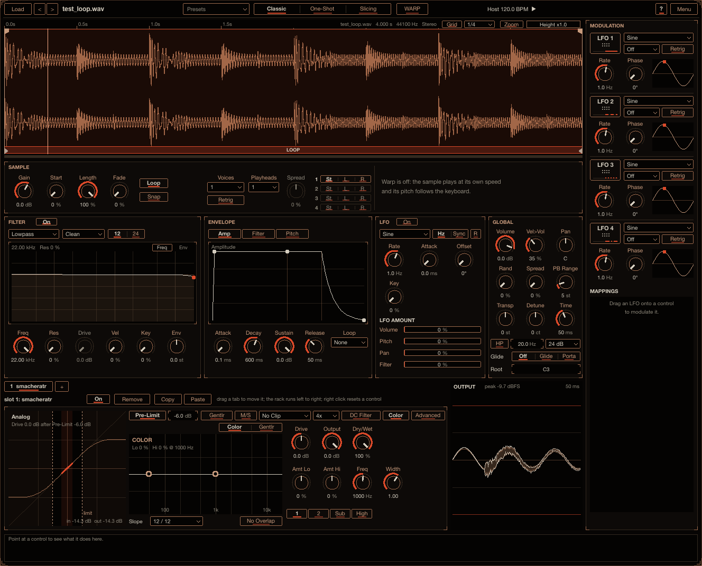
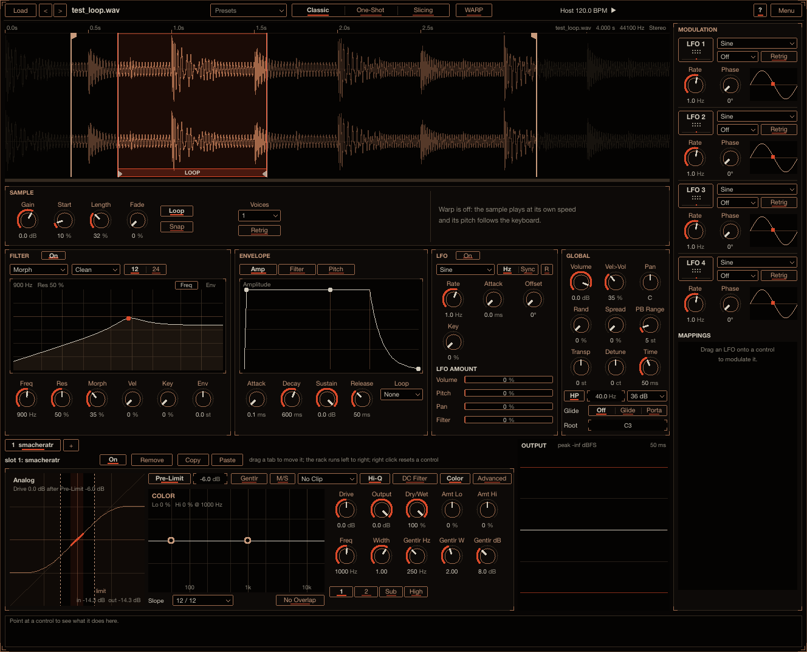
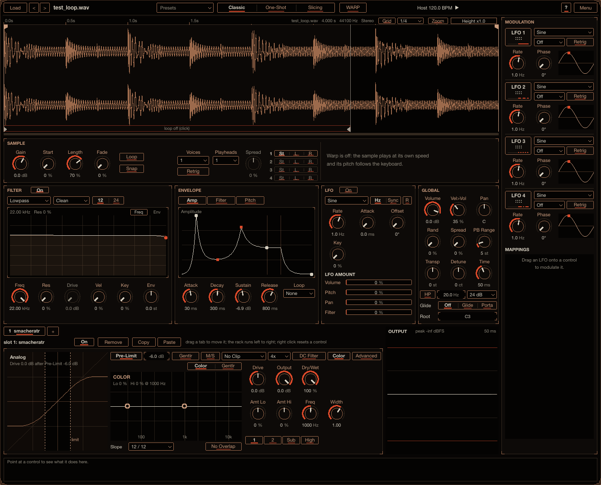
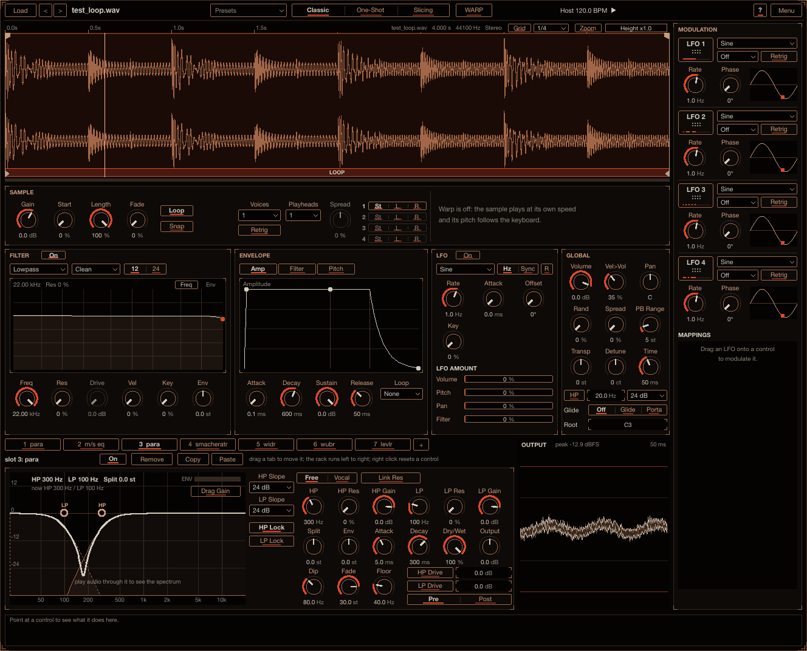

# smemplr

smemplr turns a sample into an instrument. Drop in a one-shot, a loop or a whole phrase and play it
from your keyboard: loop a part of it as a pad, play it once as a hit, or chop it into slices across
the keys. It can follow the song tempo, and it has a filter, envelopes, LFOs and an effects rack, so a
single track can go from raw sample to finished sound. Install instructions are in the
[top-level README](../../README.md).

## How to use it

1. Put smemplr on an instrument track and **drop a sample** on the waveform: a clip dragged out of
   REAPER or Ableton Live, or a file from Finder / Explorer. Or click **Load** in the header (also
   **Load Sample...** in the waveform's right-click menu), and use ◀ ▶ to step through the other samples
   in the same folder.
2. Pick a **Mode** in the SAMPLE panel: **Classic** (play it chromatically, looped by default),
   **One-Shot** (play it once, one voice) or **Slicing** (one slice per key from C1).
3. The sample plays at its own pitch on the **Root** note (C3 by default). Shape it with the FILTER,
   ENVELOPE, LFO and GLOBAL panels, add effects in the rack at the bottom, and drag a modulation LFO
   onto any control to move it.

Point at any control for help in the info box at the bottom of the window (**?** in the header also
switches on hover tooltips).

## Playing the sample

**Classic** mode: start and end flags, **Start** / **Length**, **Loop** on or off, loop **Fade**
(constant-power or linear), **Snap** to zero crossings, **Gain**, **Voices** (1 to 32, 1 by default)
with gentle voice stealing, and **Retrig**. Loop is on by default and begins at Start. **Length** is the
loop's length and never shortens the sample, which plays to the end flag; what does not play is
dimmed. **Fade**, off by default, crossfades the loop's end into its start and also fades the start in
on the first pass. Move or resize the loop while a note plays (with the mouse or by automating **Start**
and **Length**) and the playhead first finishes its pass of the loop as it was, then carries on at the
start of the loop where it is by then, through the loop's crossfade (a very short one with Fade off),
so the change lands in time and without a click.

**Playheads** (Classic, 1 by default) plays up to four parts of the sample at once for every note.
The first playhead is the loop; each of the others has a region of its own, shown in the waveform as
a numbered region with dashed edges and a dashed bar above the loop's. Drag the bar to move a region,
or drag its edges to resize it, just like the loop (the **Grid** applies too). Each region starts at
its own start and loops as the loop does (or plays to the end flag with Loop off). All the playheads go
through the same envelopes, filter, LFOs and glide, and on into the effects rack. **Spread** (-100 % to
+100 %, 0 by default) places them in the stereo field: at 0 they are all in the centre; turned up they
move apart, two of them to the left and the right, three or four spread evenly between the edges, and
negative values swap the sides. The **St** / **L** / **R** row for each playhead (numbered as in the
waveform) picks which channel of a stereo sample it reads: both, only the left or only the right (a mono
sample ignores it). With Warp on, **Beats**, **Tones**, **Texture** and **Re-Pitch** play every playhead;
**Complex** and **Complex Pro** play only the first. A new Playheads setting applies to the next notes.
Each extra playhead adds CPU, a little less than another voice would.

**One-Shot** mode: one voice, **Trigger** / **Gate**, **Fade In** / **Fade Out**, **Snap**.

**Slicing** mode: **Slice By** **Transient** (with **Sens**, up to 64 slices), **Beat** (**Division**),
**Region** or **Manual**; **Playback** **Mono**, **Poly** or **Thru**; **Trigger** / **Gate**; fades per
slice or to the end of the region. Slices are mapped chromatically from C1 (MIDI 36). Double-click
adds a slice (a solid line; automatic slices are dashed) or removes one, drag moves one, Alt-click
switches a slice between manual and automatic.

**Warp**, in every mode, locks the sample to the host tempo. **Warp Mode**: **Beats** (**Preserve**,
**Loop Mode**, **Envelope**), **Tones** (**Grain Size**), **Texture** (**Grain Size**, **Flux**),
**Re-Pitch**, **Complex** and **Complex Pro** (**Formants**, **Envelope**). **Warp as** sets the length
in beats, with ÷2 and ×2. Beats plays the sample in segments cut at its transients, Tones aligns grains
by waveform, Texture scatters grains, Complex is a phase-locked phase vocoder, and Complex Pro adds
formant correction on top.

**The waveform**: click to audition (in Slicing mode it plays the slice under the mouse). The loop bar
can be clicked and dragged, and so can the shaded loop above the waveform (a click there still
auditions). Zoom with Cmd + scroll or by dragging the ruler up and down; scroll, or drag the ruler
sideways, to pan. **Zoom**, at the right end of the ruler, zooms to the loop (Classic with Loop on) or
to the region between the flags; click it again to see the whole sample (double-clicking the ruler
does the same). **Height** beside it makes the waveform taller, up to 16 times, to see quiet parts
(drag it sideways, scroll on it, or Alt + scroll over the waveform; double-click to reset). It only
changes the drawing. The waveform is drawn at the level **Gain** gives it: turn Gain up and it grows,
and what would go past full scale (0 dBFS) is drawn in the bright peak colour. Live playheads show what
is playing.

**Grid**, at the right end of the ruler (off by default), makes the loop snap to a beat grid while you
drag it: its start, its end, or the whole loop by its bar or its shaded region. The loop then always
starts on a grid line (counted from the start flag) and is a whole number of grid steps long. The menu
beside it sets the step: 1/16, 1/8, 1/4 (the default), 1/2 or 1 bar. The tempo is the sample's own
while Warp is on (from **Warp as**) and the host's otherwise (120 BPM without one). Only drags snap,
not automation. The grid lines are drawn while it is on, and it is saved with the project.

**The right-click menu**: **Normalize Volume**, **Reverse**, **Crop to Sample Start/End** (and **Undo
Crop**), **Use Constant Power Fade for Loops**, **Reset Slice Edits**, **Show in Finder** (Explorer, File
Manager), **Load Sample...**, **Clear Sample**. None of it changes the file on disk.

A clip dropped from a DAW carries its name as text beside its audio file; the file is what gets
loaded. A temporary file (a render the DAW deletes later) is first copied to
`Documents/bfielstr/Samples`.

## Filter, envelopes, LFO and global

**FILTER**: **Lowpass**, **Highpass**, **Bandpass**, **Notch** or **Morph**, **12 dB** or **24 dB**,
**Circuit** **Clean**, **OSR**, **MS2**, **SMP** or **PRD**, **Drive**, **Morph**, and modulation from
velocity, key, the filter envelope and the LFO. Drag the response curve to set the cutoff and
resonance.

**ENVELOPE**: **Amp**, **Filter** and **Pitch** ADSR envelopes with draggable displays. The amp
envelope's **Loop Mode**: **None**, **Trigger**, **Loop**, **Beat** or **Sync**, with **Time** /
**Rate**. Each envelope can have up to 6 extra points (double-click to add one) and a curve per segment
(Shift+drag), all automatable.

**Loop Lock** (Filter and Pitch envelopes, in Classic mode with Loop on, **Off** by default) ties the
envelope to the loop. **Restart** starts the envelope again at every pass of the loop. **Fit** also
stretches its attack, points and decay to exactly one pass, at the speed the note plays.

**LFO**: **Sine**, **Square**, **Triangle**, **Saw Down**, **Saw Up** or **Random**, **Hz** or
**Sync**, **Attack**, **Retrig** with an **Offset**, **Key**, and amounts to volume, pitch, pan and the
filter. It runs per voice.

**GLOBAL**: **Pan**, random pan, **Spread** (two detuned voices left and right, decided at note-on),
**Volume**, velocity to volume, **Transpose** (±48 semitones), **Detune** (±50 cents), pitch bend range
(±5 semitones by default), **Glide** (**Glide** for mono legato, **Portamento** for poly) and its
**Time**, and **Root**. The sustain pedal (CC64) works. The mod wheel is read but not routed anywhere
yet.

**HP** (GLOBAL panel, under Transpose and Detune, off by default) is a high-pass whose cutoff follows
the transposition, so what was below the audible range in the sample (rumble, DC drift) stays out of
the way when you transpose it up. The frequency is the cutoff at 0 semitones (10 to 200 Hz, 20 Hz by
default). It moves with Transpose, Detune, pitch bend, the pitch envelope and the LFO's pitch (not with
the key played), gliding a few milliseconds so a bend or a jump does not click. Transposed down it
simply goes below the audible range. **HP Slope**: 6 or 18 dB (-3 dB at the cutoff), or 12, 24, 36 or
48 dB (Linkwitz-Riley, -6 dB at the cutoff); 24 dB by default.

**Transposing far up stays clean.** A sample read many times faster than real time (+48 semitones reads
16 samples for each one played) would fold its top octaves down as aliasing. When a sample loads,
smemplr makes band-limited copies of it at 1/2 to 1/64 of its rate (about as much memory again), and a
fast read takes the copy that suits its speed, crossfading into the next over the last quarter octave
before it, so a bend, glide or LFO moves smoothly across them. Up to +9 semitones the sample itself is
read. Complex and Complex Pro pick their copy when the note starts (with room for about an octave of
bend up); Complex Pro still takes its formants from the sample itself.

## Modulation

The MODULATION column on the right has four LFOs that can move any knob, slider or value field of
smemplr, the effects in the rack included. Each LFO has a **Shape** (**Sine**, **Triangle**, **Saw Up**,
**Saw Down**, **Square**, **S&H**: a new random value every cycle, or **Smooth Random**: gliding from one
random value to the next), a **Rate** in Hz (0.01 to 40), **Sync** (**Off**, or a note length from 1/64
to 8 bars at the host tempo, 120 BPM when the host gives none; while the host plays, a synced LFO
follows the song position, so the same place in the bar always sounds the same), a **Phase** (0 to 360
degrees) and **Retrig** (every note starts the LFO again at its Phase). They are ordinary automatable
parameters ("Mod LFO 1 Rate" and so on).

To modulate a control, **drag the LFO's handle** (the **LFO 1** button) onto it. The control is framed
in the LFO's colour while you are over one that can be modulated; let go there and the mapping is made
with a depth of +25 %. A modulated knob gets a ring in the LFO's colour showing how far the LFO moves it
(a dot shows where it is now); any other control gets a line under it.

- **Drag a knob's ring** up or down to change the depth (Shift: fine).
- **Right-click the ring** to remove the mapping. A right click on the knob itself still resets the
  knob.
- The **MAPPINGS** list shows every mapping as LFO, parameter and depth. Drag a depth up or down to
  change it, double-click it to flip it (+ / -), click its **x** or right-click the row to remove it.

Several LFOs can move the same control (their depths add up). Switches and menus cannot be modulated,
nor can the LFOs themselves. Up to 24 mappings.

The depth is a share of the control's whole range (-100 % to +100 %), added to the control's own value
and kept inside its range. The host's value never changes: automation and the control show the
parameter itself, and the LFO moves the sound around it, updated every 32 samples and smoothed over a
few milliseconds so it does not zipper. A mapping onto an effect in the rack belongs to that effect: it
moves with it when the effect is dragged to another place, goes when the effect is removed, and pauses
(dimmed in the list) while another effect is loaded into its slot. Mappings are saved with the project
and in presets.

## The effects rack

At the bottom: after the sampler, up to 8 effects in any order, and the same effect as many times as
you like. A new smemplr starts with **smacheratr** in the first slot (on, Drive 0 dB, Pre-Limit on). It
is a slot like any other, so you can move it, switch it off or remove it.

- **+** adds an effect at the end of the chain. The tabs show the chain from left to right.
- Click a tab to show that effect. **Drag a tab sideways** to move the effect (a cinnabar bar shows
  where it will land). **Ctrl-drag** (Cmd on macOS) puts a copy, with its settings, in the gap you let
  go on. **Alt-click** (Option-click) a tab removes that effect.
- For the selected effect: **On**, **Remove**, and **Copy** / **Paste**. Copy and Paste use the same
  text as each effect's own plug-in (its **Menu → Copy Settings / Paste Settings**), so settings go from
  a para on a track into a **para** slot and back, or from one slot to another of the same effect.
  Settings of a different effect are ignored.

The slots, named as the tabs show them:

- **para**: para's parallel high-pass and low-pass with its Vocal movement, **HP Slope** / **LP Slope**
  (6 to 96 dB and Brickwall), **HP Lock** / **LP Lock** (a locked gain stops at 0 dB) and a drive for
  each filter. Its envelope is triggered by the notes played in smemplr, and its display shows the live
  spectrum.
- **multidyn**: multidyn with its **Style** (**OTT** or **Character**; Soft Knee, Peak/RMS, the RMS
  window and Soften look disabled in OTT, where they do nothing), its lanes and band fields, the
  crossovers' **Slope**, Soften's **Color** and the **Sub** band. A new slot starts in OTT.
- **m/s eq**: a high-pass on the side signal (150 Hz by default) so the low end is mono below the
  cutoff, plus side and mid levels and live meters. Its slope: 6, 12, **24** (default), 36, 48, 60, 72,
  84 or 96 dB per octave (Butterworth above 6 dB, -3 dB at the cutoff), or **Brickwall** (flat to the
  cutoff within 0.05 dB, about -40 dB a tenth below it, -70 dB at 0.8 x). The mouse wheel on the
  display's handle (while holding it, or with Shift) steps through them. The mid is never filtered, so
  the mono sum is untouched.
- **smacheratr**: the full saturator: Pre-Limit, gentlr with its two bands, Sub and High bands,
  **Slope**, **No Overlap**, glue and Advanced mode, Mid/Side, colour, post clip and **Oversampling**
  (Off, 2x, 4x; a project saved before it keeps its Hi-Quality setting as 4x or Off). The **Color** |
  **Gentlr** switch above the colour display picks the layer in front (its handles, and its knobs at the
  right); grabbing a gentlr band's handle, button or Threshold slider selects the band and lights them.
- **widr**: the stereo widener with its left and right voices. In the rack it works alone: sharing the
  stereo field needs widr's own plug-in instances.
- **wubr**: wubr's two drawn bands.
- **levlr**: levlr's bands, each with its Drive and Type, and the drives' **Oversampling**.
- **gentlr**: gentlr's two bands, Sub and High bands on its display, a row of values for each, **Band
  Slope**, **No Overlap**, glue, **Advanced** and its region Drive. In gentlr and smacheratr slots the
  Sub and High bands have no buttons: they work once their Range is above 0 dB, and start at 0 dB. Drag
  a band's edge onto a neighbour's to glue them; click the link icon on the border to detach them.
  Grabbing a band's handle or any value in its row selects the band: its handle and its Threshold are lit.
- **smoothr**: smoothr's limiter and gain-reduction history. Its own saturator before the limiter is
  off in the rack: put a smacheratr slot before it for that.

Every control is an automatable parameter (the host shows a slot's values in the units of the effect
loaded there). The latency of the rack is reported to the host, which is told when it changes; a
switched-off effect keeps its latency. The **Output Scope** on the right shows the final output (click
it to change the time span).

## Presets

The **Presets** menu in the header starts with **Init** (every control at its default) and has these
factory presets: *Playback*: One-Shot Drum, Pad, Slicer. Save your own with **Save As...** (a
category and tags are optional), filter the menu by tag, and use **Save as Default** to make every
new smemplr start from the current settings. The menu is described in the [top-level
README](../../README.md#presets).

A smemplr preset holds the settings, the LFO mappings and the path of the loaded sample, as before:
loading one loads its sample, and so does a saved default (a new smemplr then starts with that
sample, if the file is still there). **Init** and the factory presets set the controls only and
clear the LFO mappings; the loaded sample stays.

## Notes and limits

- The warp algorithms are smemplr's own. They are tempo-accurate and tested. Manual warp markers are
  not supported, since there is no clip to take them from.
- The filter circuits are smemplr's own models: hard-clipped and soft-clipped state-variable filters
  and ladder variants.
- Samples are referenced by path in the project, like most samplers. If a file moves, smemplr shows
  "Missing" but keeps the reference, so it is not lost when you save.
- No MPE yet.

## Older projects

smemplr was called smempler, and simplr before 0.5.0; projects and presets carry over.

- Projects from 0.5 keep their para, multidyn and M/S EQ: they load into the first rack slots.
- Before 0.7: a para slot keeps its slope and its one drive becomes both filters' drives. A para slot
  from before the separate slopes gets its one slope on both filters, its HP Lock on unless its
  high-pass gain was above 0 dB, its LP Lock off, and keeps its Fade in semitones. A multidyn slot's
  gains move into its controls for the OTT gain staging (see [multidyn](../multidyn/README.md)), and a
  levlr slot keeps 4 bands without drive. multidyn slots saved before Style existed open in Character.
- Before 0.9 a fixed end saturator sat after the rack. Projects saved with it on load with a
  smacheratr slot at the end of their chain instead (the first free slot after the last effect, with
  the same settings); projects with it off get nothing added. If such a project's rack is full, the old
  saturator keeps running after the rack, and the rack's control line shows **old end saturator**: once
  the last slot is free, click it to move the saturator into the rack. Its parameters stay in the
  host's list as "Old End Saturator ...", so old automation still loads. Old M/S EQ slopes (6 / 12 / 24
  dB) stay what they were.
- smacheratr and gentlr slots: slots saved before the High band load with it and No Overlap off; slots
  saved while the Sub and High bands had buttons load a band that was off at Range 0 dB; slots saved
  before glue load with nothing glued.
- Projects from before the modulation LFOs load with no mappings and sound exactly as before.
- Projects from before the Grid and Playheads load with the Grid off and one playhead reading both
  channels: they sound exactly as before.

## Credits

smemplr is released under the MIT licence (see [LICENSE](../../LICENSE)). It builds on the Steinberg
VST 3 SDK (MIT), VSTGUI (BSD 3-clause) and dr_libs by David Reed (public domain / MIT-0); see
[THIRD_PARTY_NOTICES.md](../../THIRD_PARTY_NOTICES.md).
