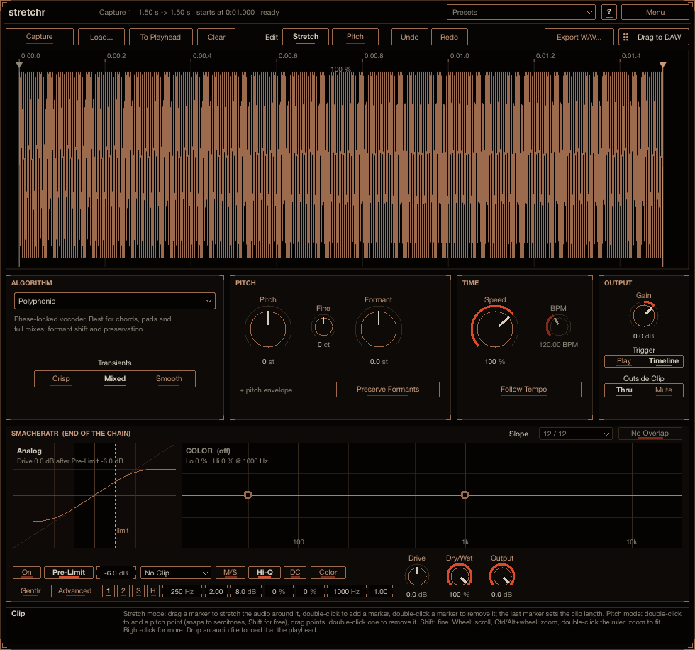
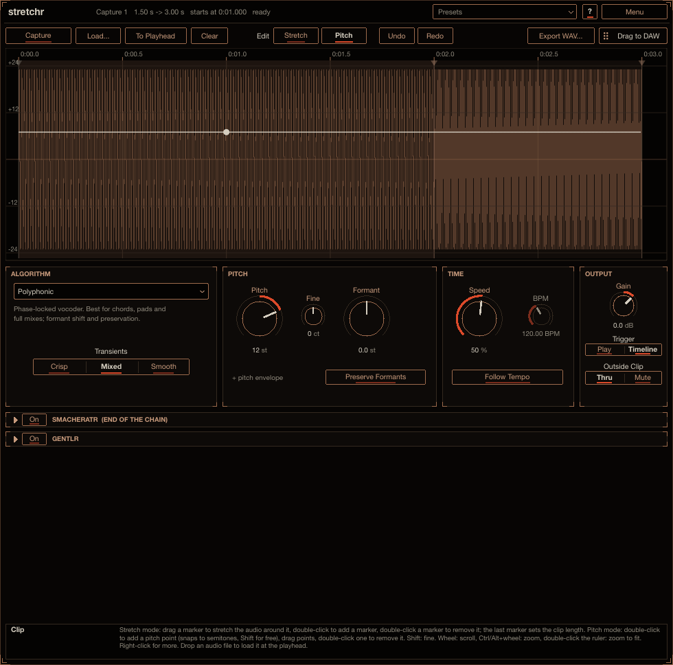

# stretchr

stretchr changes the pitch and timing of a piece of audio on a track. Record a part into it, then
transpose it, speed it up or slow it down, move single notes in time with stretch markers, bend the
pitch with a drawn envelope or shift the formants. Reach for it to fix the timing of a take, tune a
phrase, fit a loop to the song, or stretch a sound into a pad. It works as a normal insert effect in
any VST3 host, so you can freeze or bounce the result in place, or drag the rendered audio straight
onto a track. Install instructions are in the [top-level README](../../README.md).

## How to use it

A plug-in cannot read the clips on the host's timeline, so stretchr keeps its own copy of the audio:

1. **Capture**: put stretchr on the track, click **Capture**, and play the part you want to edit.
   Recording stops when the transport stops or loops (or click **Stop**). The clip remembers where on
   the timeline it was recorded. Or click **Load...** (or drop an audio file on it): the file is placed
   at the playhead. **To Playhead** moves the clip to the playhead later; **Clear** removes it.
2. **Edit**: choose an algorithm, set Pitch, Formant and Speed, drag stretch markers and draw the pitch
   envelope. The clip is re-rendered in the background (a 1-minute clip takes about a second); a thin
   bar under the waveform shows progress.
3. **Play**: while the transport plays, stretchr outputs the rendered clip in place of the track's
   audio. With **Trigger** on **Play** (the default) the clip starts the moment the host starts playing,
   from wherever the playhead is; on **Timeline** it plays where it sits on the timeline. Outside the
   clip the track passes through, or is muted (see **Outside Clip**). No latency of its own.
4. **Bounce in place**, any of:
   - **Drag to DAW**: drag the button onto a track. The render is saved as a 32-bit float WAV in
     `Music/Stretchr Renders` and dropped as a new clip.
   - **REAPER**: *Track → Freeze tracks* (or *Render/freeze → Render selected area of tracks to stereo
     stem tracks* with a time selection that covers the stretched clip).
   - **Ableton Live**: *Freeze Track* then *Flatten*, or *Bounce Track in Place* / *Bounce to New Track*
     (Live 12.2+) over a range covering the stretched clip.
   - **Export WAV...** saves the render anywhere.

   Offline renders (freezing, bouncing, rendering the project) always wait for the latest edit to
   finish rendering, so what you bounce is what you set.

The clip audio (24-bit) and all edits are saved in the project with the plug-in, so a project reopens
exactly as you left it. Clip edits have their own **Undo** / **Redo** (buttons or the right-click
menu).

Point at any control for help in the info box at the bottom (**?** also switches on hover tooltips).

## Algorithms

| Algorithm | How it works | Good for | Extra controls |
|---|---|---|---|
| **Simple Windowed** | Plain overlap-add | Drums, small changes, low CPU | **Window** (grain length) |
| **Balanced** | Overlap-add aligned by waveform similarity (WSOLA) | All-rounder | **Window** |
| **Polyphonic** | Phase-locked phase vocoder with phase resets at transients | Chords, pads, full mixes | **Transients** (**Crisp** / **Mixed** / **Smooth** frame size), **Formant**, **Preserve Formants** |
| **Soloist** | Pitch-synchronous overlap-add (PSOLA) with pitch tracking | Voices, monophonic instruments; keeps the formants in place | **Formant** |
| **Beats** | Slices at transients, loops the tails when slowed down | Drum loops | |
| **Extreme** | Long-window spectral resynthesis with random phases | Stretching 5 to 20x into pads | **Smear** (window length), **Stereo** |
| **Tape** | Varispeed (sinc resampling) | Tape-style speed changes; pitch follows Speed | |
| **Alien** | A granular cloud: grains scattered in time, a quarter of them reversed, each detuned by up to 12 cents | Strange, shimmering textures | **Window** (grain size), **Smear** (how far the grains scatter), **Stereo** |

**Stereo** (Extreme and Alien): **Wide** smears or scatters left and right apart, for a wide sound;
**Same** makes one channel and duplicates it.

Notes:
- Simple Windowed can pull pure tones slightly off pitch (by up to half the hop rate) and smears
  transients by up to one window. Use Balanced or Polyphonic when that matters.
- Soloist keeps the formants, so a pure sine or a very bright, thin sound loses level when shifted far
  up (the energy stays at the old frequency). Use Polyphonic for those.

## Editing

The waveform is drawn on the output timeline (after stretching). Copper-tinted segments are slowed
down, cinnabar-tinted ones sped up; the speed of each segment is shown on top. **Edit** switches
between **Stretch** and **Pitch**.

**Stretch**
- Double-click to add a marker; double-click a marker to remove it.
- Drag a marker to move that point of the audio in time; the audio on both sides stretches to fit.
  The last marker is the end of the clip: drag it to change the overall length.
- Shift-drag: fine. Right-click: *Add Stretch Markers at Transients*, *Reset Stretch Markers*.

**Pitch**
- Double-click to add a pitch point (it snaps to semitones; hold Shift for free values), drag points,
  double-click a point to remove it. The envelope is ±24 semitones on top of Pitch and Fine.
- Pitch points stick to the audio (they are stored in source time), so re-timing the clip moves them
  along with the notes.

**Navigation**: the wheel scrolls, Ctrl/Alt + wheel zooms, drag the background to scroll, double-click
the ruler to fit.

## Parameters

All parameters are automatable. Because the whole clip is rendered ahead of playback, a parameter
change applies to the whole clip after a short re-render rather than at a point in time; use the pitch
envelope and stretch markers for changes over time.

| Parameter | |
|---|---|
| **Algorithm** | See above |
| **Pitch** / **Fine** | Transposition in semitones / cents |
| **Formant** | Moves the formants (the vowel colour) without changing the pitch (Polyphonic, Soloist) |
| **Preserve Formants** | Polyphonic: keep the formants in place while the pitch moves |
| **Speed** | 5 to 400 % playback speed of the whole clip |
| **Follow Tempo** / **Source Tempo** | Speed = host tempo ÷ source tempo, so the clip follows the song |
| **Window** | Grain length for Simple Windowed, Balanced and Alien |
| **Transients** | Polyphonic frame size: **Crisp** (short), **Mixed**, **Smooth** (long) |
| **Smear** | Extreme's analysis window; Alien's grain scatter |
| **Stereo** | Extreme and Alien: **Wide** or **Same** |
| **Gain** | Level of the rendered clip |
| **Trigger** | **Play**: the clip starts when the host starts playing. **Timeline**: it plays where it sits |
| **Outside Clip** | **Thru** or **Mute** the track's audio outside the clip |

## smacheratr

The bottom panel is the saturator every plug-in here can end with (off, Drive 0 dB). It adds 1.7 ms
of latency, reported to the host, which keeps the clip aligned.

## Limits

- Stereo in and out. Captures up to about 45 minutes at 48 kHz. The project stores the clip audio, so
  long clips make larger project files.
- The editor and processor share memory, so the plug-in cannot run its editor in a separate process
  (fine in REAPER and Live).
- On Timeline, the clip sits at a fixed time in seconds; if you change the project tempo, move it with
  **To Playhead** or use **Follow Tempo**.
