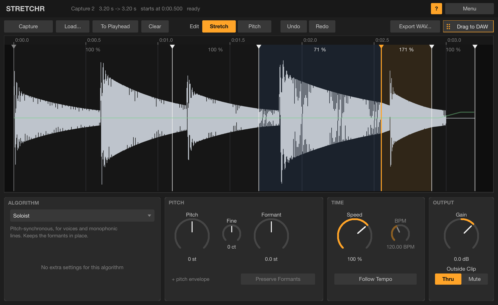

# Stretchr

A pitch and time-stretch clip editor with REAPER-style stretch algorithms, stretch markers and a
pitch envelope. It works as a normal insert effect in any VST3 host (REAPER, Ableton Live, ...), so
you can freeze/bounce the result in place or drag the rendered audio straight onto a track.
Install instructions are in the [top-level README](../../README.md).

## How it works

A plug-in can't read the clips on the host's timeline, so Stretchr keeps its own copy of the audio:

1. **Capture**: put Stretchr on the track, click **Capture**, and play the part you want to edit.
   Recording stops when the transport stops or loops (or click **Stop**). The clip remembers where
   on the timeline it was recorded. Alternatively **Load...** (or drop) an audio file; it is placed
   at the playhead (**To Playhead** moves it later).
2. **Edit**: choose an algorithm, set Pitch / Formant / Speed, drag stretch markers and draw the
   pitch envelope. The clip is re-rendered in the background (a 1-minute clip takes about a
   second); a thin bar under the waveform shows progress.
3. **Play**: while the transport plays through the clip, Stretchr outputs the rendered clip in
   place of the track's audio. Outside the clip the track passes through (or is muted, see
   **Outside Clip**). No latency.
4. **Bounce in place**, any of:
   - **Drag to DAW**: drag the button onto a track; the render is saved as a 32-bit float WAV
     in `Music/Stretchr Renders` and dropped as a new clip.
   - **REAPER**: *Track → Freeze tracks* (or *Render/freeze → Render selected area of tracks to
     stereo stem tracks* with a time selection that covers the stretched clip).
   - **Ableton Live**: *Freeze Track* then *Flatten*, or *Bounce Track in Place* / *Bounce to New
     Track* (Live 12.2+) over a range covering the stretched clip.
   - **Export WAV...** saves the render anywhere.

   Offline renders (freezing, bouncing, rendering the project) always wait for the latest edit to
   finish rendering, so what you bounce is what you set.

The clip audio (24-bit) and all edits are saved in the project with the plug-in, so a project
re-opens exactly as you left it. Clip edits have their own **Undo/Redo** (buttons or the
right-click menu).

## Algorithms

Modelled on the kinds of stretch modes REAPER offers:

| Algorithm | Method | Good for | Extra control |
|---|---|---|---|
| **Simple Windowed** | Plain overlap-add | Drums, small changes, low CPU | Window (grain length) |
| **Balanced** | Waveform-similarity overlap-add (WSOLA, SoundTouch-style) | All-rounder | Window |
| **Polyphonic** | Phase-locked phase vocoder with phase resets at transients (élastique Pro / Rubber Band style) | Chords, pads, full mixes | Transients (Crisp / Mixed / Smooth frame size), Formant shift, Preserve Formants |
| **Soloist** | Pitch-synchronous overlap-add (PSOLA) with pitch tracking | Voices, monophonic instruments; keeps formants in place | Formant shift |
| **Beats** | Slices at transients, loops tails when slowed | Drum loops | |
| **Extreme** | Long-window spectral resynthesis with random phases (Paulstretch / "Rrreeeaaa" style) | Stretching 5–20x into pads | Smear (window length) |
| **Tape** | Varispeed (sinc resampling) | Tape-style speed changes; pitch follows Speed | |

Notes:
- Simple Windowed can pull pure tones slightly off pitch (by up to half the hop rate) and smears
  transients by up to one window; that is the nature of the method. Use Balanced or Polyphonic
  when that matters.
- Soloist preserves formants, so a pure sine or a very bright, thin sound loses level when shifted
  far up (the energy stays at the old frequency). Use Polyphonic for those.

## Editing

The waveform is drawn on the output timeline (after stretching). Blue segments are slowed down,
orange ones sped up; the speed of each segment is shown on top.

**Stretch mode**
- Double-click to add a marker; double-click a marker to remove it.
- Drag a marker to move that point of the audio in time; the audio on both sides stretches to
  fit. The last marker is the end of the clip: drag it to change the overall length.
- Shift-drag: fine. Right-click: *Add Stretch Markers at Transients*, *Reset Stretch Markers*.

**Pitch mode**
- Double-click to add a pitch point (snaps to semitones; hold Shift for free values), drag
  points, double-click a point to remove it. The envelope is ±24 semitones on top of Pitch/Fine.
- Pitch points stick to the audio (they are stored in source time), so re-timing the clip moves
  them along with the notes.

**Navigation**: wheel scrolls, Ctrl/Alt+wheel zooms, drag the background to scroll,
double-click the ruler to fit.

## Parameters

All parameters are automatable. Because the whole clip is rendered ahead of playback, a parameter
change applies to the whole clip after a short re-render rather than at a point in time; use the
pitch envelope and stretch markers for changes over time.

| Parameter | |
|---|---|
| Algorithm | See above |
| Pitch / Fine | Transposition in semitones / cents |
| Formant | Moves the formants (vowel colour) without changing the pitch (Polyphonic, Soloist) |
| Preserve Formants | Polyphonic: keep the formants in place while the pitch moves |
| Speed | 5–400 % playback speed of the whole clip |
| Follow Tempo / Source Tempo | Speed = host tempo ÷ source tempo |
| Window | Grain length for Simple Windowed / Balanced |
| Transients | Polyphonic frame size: Crisp (short), Mixed, Smooth (long) |
| Smear | Extreme's analysis window |
| Gain | Level of the rendered clip |
| Outside Clip | Thru or Mute the track's audio outside the clip |

## Limits

- Stereo in/out. Captures up to about 45 minutes at 48 kHz; the project stores the clip audio, so
  long clips make larger project files.
- The editor and processor share memory, so the plug-in can't run the editor in a separate process
  (fine in REAPER and Live).
- The clip sits at a fixed time in seconds; if you change the project tempo, move it with
  **To Playhead** or use **Follow Tempo**.
