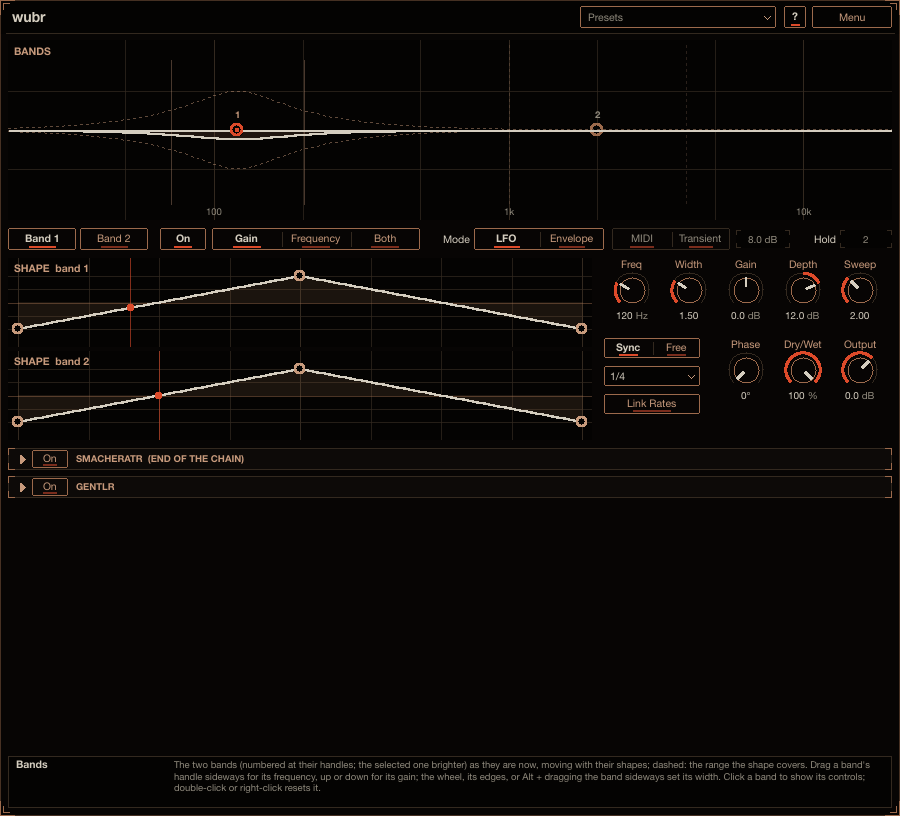
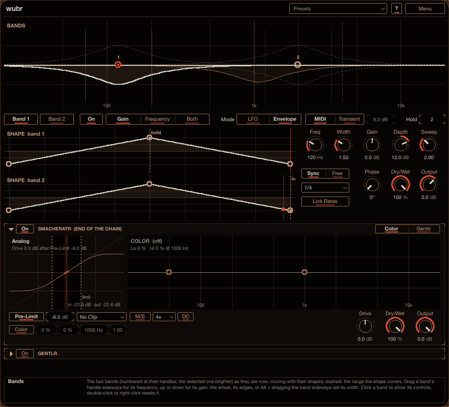

# Wubr

Wubr moves two EQ bands with shapes you draw. A band's level or its frequency (or both) follows the
shape, so you get wubs, pumps, wobbles and sweeps, locked to the song or running free. In Envelope mode
the shapes run once, fired by a MIDI note or by a hit in the audio. Reach for it to make a bass wobble,
add rhythmic movement to a pad, duck a band in time with the kick, or sweep a resonance on every hit.
Install instructions are in the [top-level README](../../README.md).

## How to use it

1. Put Wubr on a track. Both bands are on and already sweeping their centres, but at **Gain** 0 dB a
   sweep changes nothing: drag a band's handle up or down in the band display to hear it.
2. Draw the movement in each band's **Shape**: drag points, bend lines, add or remove points.
3. Set the speed with **Rate** (**Sync** to the song or **Free** in Hz), or switch **Mode** to
   **Envelope** to fire the shapes from MIDI notes or transients.

Point at any control for help in the info box at the bottom (**?** also switches on hover tooltips).

## Controls

- **Band 1** and **Band 2**: two bell bands (numbered 1 and 2 at their handles in the display), each with
  **On**, **Freq**, **Width** (octaves), **Gain**, and a target:
  - **Gain**: the band's level is Gain + **Depth** x the shape (dB): +Depth at the top, -Depth at the
    bottom.
  - **Frequency**: the band sits at Gain and its centre moves **Sweep** octaves (half up at the top, half
    down at the bottom).
  - **Both**: both at once.
- **Shape** (one per band): up to 8 points. Drag a point to move it, drag a line up or down to bend it,
  double-click to add or remove a point, right-click a line to straighten it. A dot shows where the band
  is now.
- **Rate** (per band): **Sync** (1/32 to 4 bars, dotted and triplet; locked to the song position while
  the host plays) or **Free** (Hz, 0.75 by default), and a **Phase** offset. **Link Rates** (on by
  default): both bands run at band 1's rate, each with its own phase.
- **Mode**:
  - **LFO**: the shapes run over and over.
  - **Envelope**: a trigger starts the shapes from the beginning; each runs to its **Hold** point
    (Alt-click a point, or set the Hold box) and stays there. **MIDI**: a note starts them, and letting
    go of the last note plays the rest of the shape. **Transient**: a hit in the audio starts them
    (**Sens**: how far it must jump over the recent level); they hold until the next hit.
- **Dry/Wet** and **Output**.
- **Smacheratr** (bottom panel): the saturator every plug-in here can end with, with all its controls
  and displays (off by default, Drive 0 dB).

## The band display

It shows both bands as they are right now. Drag a band's handle sideways for its frequency and up or
down for its gain; drag its edges (or use the wheel, or Alt + drag the band sideways) for its width.
Both bands' shapes are shown too, band 1 above band 2.

Wubr is also in Smemplr's effects rack.
